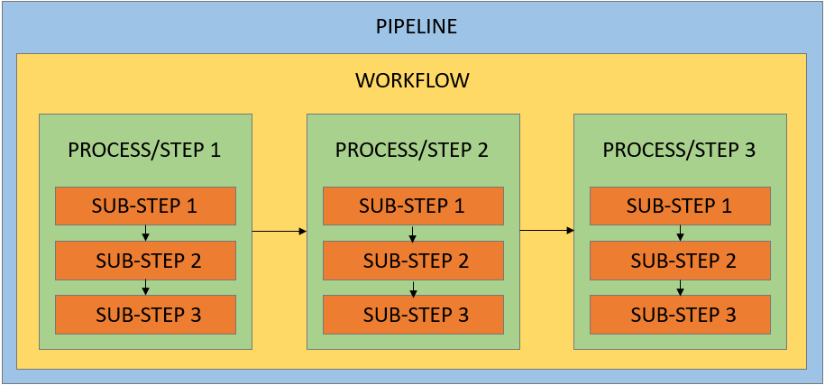
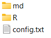

# Build a pipeline with MagellanNTK

Abstract

The R package MagellanNTK (Magellan Navigation ToolKit) is a workflow
manager using Shiny modules. It is the perfect companion package to
build workflows and integrate them in your UI or run it standalone.

## Introduction

`MagellanNTK` is a package that offers the core infrastructure,
configuration tools, and step-by-step execution needed to build
workflows within a `Shiny` application. It serves as a framework upon
which `Shiny` modules can be assembled to create customized analysis
pipelines. Because it supports data structured as
`MultiAssayExperiment`, it can be applied across a wide range of
domains, including genetics, epigenetics, proteomics, single-cell
proteomics, immuno-oncology, and more.

`MagellanNTK` is designed around three main objectives :

- Generality, allowing it to accommodate a wide variety of dataset types
- Versatility, enabling the integration of diverse workflows
- Code encapsulation, embedding as much functionality as possible to
  minimize the amount of code required in process modules, so these
  modules primarily define the UI components and core logic.

This simplifies the development of process modules but introduces
certain constraints, notably strict naming conventions. As the framework
relies heavily on dynamic function surcharge to minimize the amount of
“developer-level” code required, adhering to these naming conventions
becomes essential.

This vignette explains how to create a new pipeline using the
`MagellanNTK` framework.

To learn more about MagellanNTK pipeline from a user perspective, see
`MagellanNTK user manual`.

### Installation

To install `MagellanNTK` :

``` r

if (!requireNamespace("BiocManager", quietly = TRUE))
    install.packages("BiocManager")
BiocManager::install("MagellanNTK")
```

``` r

library(MagellanNTK)
```

    ## Warning: replacing previous import 'S4Arrays::makeNindexFromArrayViewport' by
    ## 'DelayedArray::makeNindexFromArrayViewport' when loading 'SummarizedExperiment'

### Key terms

The key terms used throughout this documentation are defined as follow
(Fig. @ref(fig:keytermsOrganisation)) :

- **Pipeline** : The complete structure that includes the workflow along
  with all related elements (e.g., FAQ, Convert module, etc).
- **Workflow** : The ordered sequence of processes of the pipeline.
- **Process or step** : An individual step within a workflow. Each
  process corresponds to a dedicated Shiny module and is implemented in
  its own file.
- **Sub-step** : An individual step within a process. A process may have
  as many sub-step as needed.



Key terms definition

### PipelineTemplate

To facilitate the creation of a new pipeline, there is a directory
containing module templates in the `MagellanNTK` package, named
`PipelineTemplate`. These templates can be found by following the path
`MagellanNTK/inst/workflow/PipelineTemplate/`, either in the package
files or directly on the [MagellanNTK GitHub
repository](https://github.com/edyp-lab/MagellanNTK).

`PipelineTemplate` includes all the required directories, the
configuration file, and the core code needed for the various modules
that make up the pipeline.

### PipelineDemo

A complete and functional demo pipeline is available in the
`MagellanNTK` package, named `PipelineDemo`. It illustrates how all
components fit together in practice. If any part of the pipeline
structure or implementation is unclear, this example can be used as a
reference to better understand how the different elements are organized
and interact. The whole pipeline is explained in the ‘MagellanNTK’
vignette.

The code for this demo pipeline can be found by following the path
`MagellanNTK/inst/workflow/PipelineDemo/`, either in the package files
or directly on the [MagellanNTK GitHub
repository](https://github.com/edyp-lab/MagellanNTK).

To launch `PipelineDemo`, use the following code :

``` r

wf.path <- system.file('workflow/PipelineDemo', package = 'MagellanNTK')
MagellanNTK(wf.path, 'PipelineDemo')
```

### General overview of MagellanNTK

#### Data format

`MagellanNTK` relies on `MultiAssayExperiment` (MAE) objects as its core
data structure. MAE extend the `SummarizedExperiment` (SE) framework by
grouping multiple SE within a single object. This structure enables
tracking of the different transformations applied at each step of the
workflow. `MagellanNTK` can also operate on data formats derived from
MAE, such as `QFeatures`.

This data structure enables working with a single object while
preserving all previous states of the dataset. At the start of each
process, the input must be a `MultiAssayExperiment`, and all operations
should be performed on its latest `SummarizedExperiment`. The output
must also be an `MultiAssayExperiment`, with an additional SE containing
the results of the process. Previously existing `SummarizedExperiment`
should remain unchanged to ensure full traceability of the analysis.

Since the workflow relies on this format, input data must be provided as
a `MultiAssayExperiment`. However, the ‘Convert’ process allows other
data formats (e.g., .csv, .txt) to be imported and transformed into a
valid MAE, ensuring compatibility with the pipeline (see section 9).

#### Modules in MagellanNTK

Shiny modules are a central component of pipelines in `MagellanNTK`.
Within a pipeline, each process is implemented as a Shiny module. These
modules take a `MultiAssayExperiment` as input and return an updated
`MultiAssayExperiment`, to which a new `SummarizedExperiment` is
appended, named after the executed step (see Section 3).

Outside of the workflow, several standalone modules exist, including :

- `EDA` : Exploratory Data Analysis. Accessible via the “EDA” button in
  the workflow. It opens a pop-up window with three tabs, each
  corresponding to a separate module. Typically, the first tab displays
  dataset information, the second shows the processing history, and the
  third presents various visualizations (see Section 2.1).
- `open_dataset` : Located in the “Open File” tab under the “Dataset”
  section of the sidebar. It allows loading an existing dataset (see
  Section 2.1).
- `download_dataset` : Located in the “Save As” tab under the “Dataset”
  section of the sidebar. It allows saving the current dataset locally
  (see Section 2.1).
- `Convert` : Located in the “Import” tab under the “Dataset” section of
  the sidebar. It allows importing data from external formats and
  converting it into a `MultiAssayExperiment` (see Section 8).

#### History

The `MultiAssayExperiment` structure makes it possible to track all
operations performed throughout a workflow. To support this,
`MagellanNTK` provides a history system that records the values of the
parameters used during data processing. MagellanNTK includes built-in
functions to manage this history:
[`InitializeHistory()`](../reference/InitializeHistory.md) to create it,
[`GetHistory()`](../reference/GetHistory.md) to retrieve it,
[`Add2History()`](../reference/Add2History.md) to record new entries,
and [`SetHistory()`](../reference/SetHistory.md) to attach it to the
dataset (see section 2.1). A history is associated with a specific
`SummarizedExperiment`, not with the entire `MultiAssayExperiment`. As a
result, each SE contains information related to the step it corresponds
to.

The history is structured as a table with four columns :

- **Process** : The name of the process.
- **Step** : The name of the sub-step.
- **Parameter** : The name of the parameter being recorded.
- **Value** : The corresponding parameter value.

At least one parameter should be recorded for each validated sub-step.
This is important because the “Step” column is used to determine which
sub-steps have been validated, particularly when reloading a dataset
that has already been processed. More generally, it is recommended to
log as many parameters as possible to ensure full traceability and
facilitate reproducibility of the analysis.

## Folder and files configuration

The first step is to create the directories and files required for the
pipeline. Each pipeline has its own directory, which contains all
elements specific to that workflow. There are no restrictions on
Pipeline names, provided they do not include spaces, hyphens, or special
characters, only alphanumerical characters.

This directory can either be included within an R package (under the
inst/ folder) or stored directly on a local machine. MagellanNTK only
requires the path to this directory.

For example, for a pipeline named “PipelineName” :

- **On a local computer**, the path to provide could be
  `C:\Windows\Users\UserName\PipelineName`
- **Inside an R package** (here called “PackageName”), the path can be
  retrieved with :
  `system.file("PipelineName", package = "PackageName")`

The PipelineName directory must contain the following directories and
files (Fig. @ref(fig:configfolders)) :

- md : Folder that contains .Rmd files related to the pipeline, such as
  the pipeline’s home page or FAQ.
- R : Folder that contains .R files, including the modules for the
  different processes.
- config.txt : File containing various settings related to the pipeline.



Mandatory folders and files

Other files or directories may be included in this directory, but only
the ones listed above are required.

### config.txt

When a pipeline is launched using MagellanNTK, one of its parameters is
the path to the directory containing the pipeline to be launched.
MagellanNTK uses this to load the config.txt file, which allows it to
dynamically instantiate generic functions, among other things.

The config.txt file can be divided into multiple sections.

The first one defines general settings used by MagellanNTK :

- `extension` : Restricts file selection to files with this extension
  when loading a dataset.
- `package` : If the pipeline is included in a package, this is the name
  of the package containing it.

The second one specifies the packages from which to use the “core”
functions. These functions have a default version available in
MagellanNTK, but can be modified and customized to suit the pipeline’s
needs. The source code for these functions must be stored in a package’s
R directory so that they can be called using the `::` command. This
package may be a different package from the one in which the pipeline is
located. It is important that these functions, if customized, have the
same names, inputs, and outputs as the default functions included in
MagellanNTK. These functions can be divided into two categories: the
first consists of Shiny modules, which must therefore contain both
`FunctionName_ui()` and `FunctionName_server()`, and the second consists
of standard functions.

These functions are described below :

- Shiny modules :
  - `open_dataset` : Open and load a dataset (instance of
    `MultiAssayExperiment`).
  - `infos_dataset` : The first tab of the EDA tool. Usually used to
    display informations about the dataset.
  - `history_dataset` : The second tab of the EDA tool which displays
    the history stored in the last SE of the dataset.  
  - `view_dataset` : The third tab of the EDA tool. Usually used to
    display various graphs.
  - `download_dataset` : Offers a UI to export the dataset in different
    format. Default format is .rdata.
- Standard functions :
  - `addDatasets` : Add the ‘dataset’ (e.g. a `SummarizedExperiment`) to
    the object (e.g. a `MultiAssayExperiment`)
  - `keepDatasets` : Delete some SE in the dataset to keep only the
    required SE.
  - `InitializeHistory` : Fill the initial history slot in the first SE
    of the dataset.
  - `Add2History` : Adds additional information to the variable
    rv.custom\$history, which is used to make the history inside of a
    process.
  - `GetHistory` : Returns the history from a given SE.
  - `SetHistory` : Set a value to the history slot of a SE. Usually used
    at the end of each process.

The third one defines where are the user manual and the release notes.
It can be an URL leading to a file or a path inside the package.

- `URL_manual` : Link or path to the user manual.
- `URL_ReleaseNotes` : Link or path to the release notes.

### R

This directory contains the source files for the Shiny modules
corresponding to the various processes of the pipeline.

It must contain at least the following files :

- A file defining the pipeline itself, named `PipelineName.R`.
- A file for the ‘Description’ process, which MagellanNTK automatically
  adds to every pipeline? named `PipelineName_Description.R`.
- One file per process in the workflow, each following the naming
  convention `PipelineName_ProcessName.R`.
- A file for the ‘Save’ process, also automatically added by
  MagellanNTK, named `PipelineName_Save.R`.

### md

This directory stores the .Rmd files describing the different steps of
the pipeline, along with optional supplementary materials such as FAQs
or external links. Each step-specific .Rmd file must use the same name
as its corresponding R script in the R directory, i.e.,
`PipelineName_ProcessName.Rmd`. These files are called in the process
modules during the first sub-step (‘Description’) and are displayed in
the interface via the `output$Description <- renderUI({ })` block (see
section 5).

## Code Structure of a Shiny Module for MagellanNTK

Each process in the pipeline must follow the same basic structure. In
addition, each process must have its own R file named
`PipelineName_ProcessName.R`. These files must be placed in the
pipeline’s R folder (see section 2.2). Each of these files must contain
the following three functions:

- `PipelineName_ProcessName_conf()` : Configures the process. This
  function configures the process by calling the
  [`Config()`](../reference/Config-class.md) function (provided by
  `MagellanNTK`), which creates an object of class `Config`. This object
  stores key structural information about the workflow. The function
  itself is a standard R function, not a Shiny module, and the resulting
  `Config` object is used to define and manage the configuration of
  processes within `MagellanNTK`.
- `PipelineName_ProcessName_ui()` : Declares the UI for the module. This
  function is identical for all processes and requires no customization.
  It is almost empty but must be present.
- `PipelineName_ProcessName_server()` : Implements the server part of
  the process and therefore defines the entire step. It contains all
  module-specific code, including the construction of UI elements, since
  these interfaces are generated dynamically using Shiny’s
  [`uiOutput()`](https://rdrr.io/pkg/shiny/man/htmlOutput.html)
  function. This is why the `PipelineTemplate_ui()` function remains
  empty.

The ’\_conf’ function has no parameters. The ’\_ui’ function takes a
single parameter, `id`, while the ’\_server’ function includes the
following parameters:

- `id` : A `character(1)` representing the ‘id’ of the module.
- `dataIn` : A `MultiAssayExperiment`, which is the input data.
- `steps.enabled` : A logical vector with the same length as the number
  of process or sub-step. It controls which steps are enabled or
  disabled in the interface.
- `remoteReset` : An [`integer()`](https://rdrr.io/r/base/integer.html)
  acting as a remote signal to reset the module, indicating whether the
  pipeline has been reset at a higher level.
- `steps.status` : A
  [`character()`](https://rdrr.io/r/base/character.html) vector
  describing the status of each step, which can be “validated”,
  “undone”, or “skipped”.
- `current.pos` : A `integer(1)` used as a remote command to set a step
  as active (1) or inactive (0) in the workflow timeline.

As described in section 1.4, the data format used throughout the
pipeline is a `MultiAssayExperiment` (MAE). At the end of each process,
a new `SummarizedExperiment` (SE) is appended to the MAE. Although
`dataIn()` provides access to the input dataset within a process, it is
good practice to store it at the beginning in `rv$dataIn`. This reactive
value is automatically created in each process by MagellanNTK, but the
dataset needs to be manually store in it (see process descriptions
below). Any modifications should then be applied to `rv$dataIn`, never
directly to `dataIn()`. This ensures that the original dataset remains
accessible (e.g., in case of a reset) and avoids unintended side
effects.

`dataOut$value` represents the dataset returned by the process. This
variable is present at the end of each sub-step (see process
descriptions below). For intermediate sub-steps, this value should be
set to `NULL`. For the final sub-step (typically the ‘Save’ step),
`dataOut$value` should be set to `rv$dataIn`, which corresponds to the
updated MAE with the newly added SE reflecting the results of the
process.

`widgets.default.values` and `rv.custom.default.values` are two
important variables found in every process. These are list that are,
respectively, used to store default values and initialize widgets and
reactive values that will be used in the process. Values defined in
`widgets.default.values` are accessible via `rv.widgets$Name`, while
those defined in `rv.custom.default.values` can be accessed through
`rv.custom$Name`. In addition to initializing the widgets and reactive
values used in a process, they also enable resetting them by restoring
their default values when a reset is triggered.

## PipelineName.R file

The `PipelineName.R` file is essential because it is used to create the
pipeline itself, and in particular to define the various steps that make
up the workflow.

Like all files in the R folder, PipelineName.R contains three main
functions:

- `PipelineName_conf()` which is a function that configures the entire
  pipeline.
- `PipelineName_ui()` and `PipelineName_server()` that define the
  associated module.

### PipelineName_conf()

Of the three functions included in this file, this is the only one for
which settings need to be changed.

The code for this function is as follow :

``` r

PipelineName_conf <- function(){
  MagellanNTK::Config(
    fullname = 'PipelineName',
    mode = 'pipeline',
    steps = c("Process1", "Process2"),
    mandatory = c(FALSE, TRUE)
  )
}
```

This function calls the [`Config()`](../reference/Config-class.md)
function from MagellanNTK with the following arguments :

- `fullname` : The exact name of the pipeline.
- `mode` : Specifies what is being initialized. Here, ‘pipeline’
  indicates that this file is setting up the entire pipeline.
- `steps` : A vector listing all processes in the workflow (excluding
  “Description” and “Save,” which MagellanNTK adds automatically). It
  should contains the name of each process in the order they are
  intended to be in.
- `mandatory` : A logical vector matching the length of the one in
  `steps`. It defines which processes are mandatory (TRUE) and which may
  be skipped (FALSE).

### PipelineName_ui() and PipelineName_server()

These two functions define, respectively, the UI and server components
of the pipeline’s main module.

Since nothing needs to be changed in these functions, they will not be
discussed in detail here. Note that they contain the same basic code
found in the process modules, which we will cover later in this
vignette.

``` r

PipelineName_ui <- function(id){
  ns <- NS(id)
}
```

``` r

PipelineName_server <- function(id,
  dataIn = reactive({NULL}),
  steps.enabled = reactive({NULL}),
  remoteReset = reactive({0}),
  steps.status = reactive({NULL}),
  current.pos = reactive({1}),
  path = NULL
){
  widgets.default.values <- NULL
  rv.custom.default.values <- NULL
  
  moduleServer(id, function(input, output, session) {
    ns <- session$ns
    
    core.code <- MagellanNTK::Get_Workflow_Core_Code(
      name = id,
      w.names = names(widgets.default.values),
      rv.custom.names = names(rv.custom.default.values)
    )
    
    eval(str2expression(core.code))
    
    eval(parse(text = MagellanNTK::Module_Return_Func()))
  })
}
```

## PipelineName_Description.R file

The “Description” step is automatically added to the workflow by
MagellanNTK. Therefore, the file associated with this step is required.
This step serves as the starting point for the workflow. When a dataset
is loaded, this step is automatically validated.

Similarly to what we saw earlier, this file contains the three functions
`PipelineName_Description_conf()`, `PipelineName_Description_ui()` and
`PipelineName_Description_server()`.

### PipelineName_Description_conf()

The code for this function is as follow :

``` r

PipelineName_Description_conf <- function(){
  MagellanNTK::Config(
    mode = 'process',
    fullname = 'PipelineName_Description',
  )
}
```

There is a few differences with `PipelineName_conf()`, notably :

- `mode` : Here, this is a process that is being initialized, hence
  ‘process’.
- `fullname` : The name is not only the name of the process, but a
  concatenation of the name of the pipeline with the name of the
  process, separated by ’\_‘. As a general rule, ’fullname’ must match
  the filename.
- `steps` and `mandatory` : Neither of these is defined here because
  this process contains no sub-steps (apart from the “Description”
  sub-step, which does not require explicit definition).

### PipelineName_Description_ui() and PipelineName_Description_server()

These two functions define, respectively, the UI and server components
of the description process module.

The ui function is the same for every module and should not be modified.

``` r

PipelineName_Description_ui <- function(id){
  ns <- NS(id)
}
```

The code for the server function is as follows, and is explained in
detail below (for a description of the function parameters, please refer
to the function man) :

``` r

PipelineName_Description_server <- function(id,
  dataIn = reactive({NULL}),
  steps.enabled = reactive({NULL}),
  remoteReset = reactive({0}),
  steps.status = reactive({NULL}),
  current.pos = reactive({1}),
  path = NULL,
  btnEvents = reactive({NULL})
){

  widgets.default.values <- list()
  rv.custom.default.values <- list(
    history = MagellanNTK::InitializeHistory()
  )
  
  ###########################################################################-
  #
  #----------------------------MODULE SERVER----------------------------------
  #
  ###########################################################################-
  moduleServer(id, function(input, output, session) {
    ns <- session$ns
    
    core.code <- MagellanNTK::Get_Workflow_Core_Code(
      mode = 'process',
      name = id,
      w.names = names(widgets.default.values),
      rv.custom.names = names(rv.custom.default.values)
    )
    
    eval(str2expression(core.code))

    ###########################################################################-
    #
    #-----------------------------DESCRIPTION-----------------------------------
    #
    ###########################################################################-
    output$Description <- renderUI({
      
      file <- normalizePath(file.path(
        system.file('workflow', package = 'MagellanNTK'),
        unlist(strsplit(id, '_'))[1], 
        'md', 
        paste0(id, '.Rmd')))
      
      MagellanNTK::process_layout(session,
        ns = NS(id),
        sidebar = tagList(),
        content = tagList(
          if (file.exists(file))
            includeMarkdown(file)
          else
            p('No Description available')
        )
      )
    })
    
    observeEvent(req(btnEvents()), ignoreInit = TRUE, ignoreNULL = TRUE,{
      req(grepl('Description', btnEvents()))
      
      req(dataIn())
      rv$dataIn <- dataIn()

      rv.custom$history <- Add2History(rv.custom$history, 'Description', 'Description', 'Initialization', '-')
      
      len <- length(rv$dataIn)
      rv$dataIn[[len]] <- SetHistory(rv$dataIn[[len]], rv.custom$history)
      
      dataOut$trigger <- MagellanNTK::Timestamp()
      dataOut$value <- rv$dataIn
      rv$steps.status['Description'] <- MagellanNTK::stepStatus$VALIDATED
    })
    
    eval(parse(text = MagellanNTK::Module_Return_Func()))
  }
  )
}
```

#### PipelineName_Description_server() detailled explanation

``` r

 widgets.default.values <- list()

  rv.custom.default.values <- list(
    history = MagellanNTK::InitializeHistory()
  )
```

`widgets.default.values` and `rv.custom.default.values` are used to
store default values and initialize widgets and reactive values,
respectively, that will be used in the process. In this case, the
process does not contain any widgets, so `widgets.default.values` is an
empty list, and only one reactive value (history) is initialized. Values
defined in `widgets.default.values` are accessible via
`rv.widgets$Name`, while those defined in `rv.custom.default.values` can
be accessed through `rv.custom$Name`.

``` r
  moduleServer(id, function(input, output, session) {
      ns <- session$ns
      
      core.code <- MagellanNTK::Get_Workflow_Core_Code(
        mode = 'process',
        name = id,
        w.names = names(widgets.default.values),
        rv.custom.names = names(rv.custom.default.values)
      )
      
      eval(str2expression(core.code))
      
      [...]
      
      eval(parse(text = MagellanNTK::Module_Return_Func()))
  }
```

This part of the code must not be modified.
[`moduleServer()`](https://rdrr.io/pkg/shiny/man/moduleServer.html) is
the function that initiates the creation of the module that makes up the
process, as well as the various variables required for the module to
function, such as the widgets values and reactive values previously
initialized with `widgets.default.values` and
`rv.custom.default.values`. The section `[...]` contains the various
variables, functions, and outputs that define the module’s functionality
and appearance, such as the following code parts below.

``` r

    output$Description <- renderUI({
      
      file <- normalizePath(file.path(
        system.file('workflow', package = 'MagellanNTK'),
        unlist(strsplit(id, '_'))[1], 
        'md', 
        paste0(id, '.Rmd')))
      
      MagellanNTK::process_layout(session,
        ns = NS(id),
        sidebar = tagList(),
        content = tagList(
          if (file.exists(file))
            includeMarkdown(file)
          else
            p('No Description available')
        )
      )
    })
```

`output$Description <- renderUI({})` defines everything that should be
displayed for the associated sub-step of the process. The naming
convention follows `output$SubstepName`, and it always uses a
[`renderUI()`](https://rdrr.io/pkg/shiny/man/renderUI.html) function.

The layout itself is constructed using the
[`process_layout()`](../reference/process_layout.md) function. Its key
arguments are:

- `sidebar` : Defines the content displayed in the sidebar.
- `content` : Defines what appears in the main panel.

In this case, the goal is to display the .Rmd file associated with the
Description process, located in the md (see section 2.3). This is
handled through the file object, and the content is rendered using
[`includeMarkdown()`](https://rstudio.github.io/htmltools/reference/include.html)
when the file exists.

``` r

  observeEvent(req(btnEvents()), ignoreInit = TRUE, ignoreNULL = TRUE,{
        req(grepl('Description', btnEvents()))
        
        req(dataIn())
        rv$dataIn <- dataIn()
  
        rv.custom$history <- Add2History(rv.custom$history, 'Description', 'Description', 'Initialization', '-')
        
        len <- length(rv$dataIn)
        rv$dataIn[[len]] <- SetHistory(rv$dataIn[[len]], rv.custom$history)
        
        dataOut$trigger <- MagellanNTK::Timestamp()
        dataOut$value <- rv$dataIn
        rv$steps.status['Description'] <- MagellanNTK::stepStatus$VALIDATED
      })
```

This block defines what happens when a “Run” button is clicked. This
[`observeEvent()`](https://rdrr.io/pkg/shiny/man/observeEvent.html) must
be there for each sub-step. The line
`req(grepl('SubstepName', btnEvents()))` specifies which sub-step the
event is associated with.

It is good practice to store the current dataset (`dataIn()`) in the
reactive value `rv$dataIn`. Any subsequent modifications should be
applied to `rv$dataIn`, rather than directly to `dataIn()`, to ensure
consistent behavior.

Updating the history at each sub-step is also recommended. In this
example, the history is initialized beforehand in
`rv.custom.default.values`. The
[`Add2History()`](../reference/Add2History.md) function records the
actions performed at this stage, ensuring traceability of the workflow.
This history is then attached to the dataset (e.g., a
`SummarizedExperiment`) using
[`SetHistory()`](../reference/SetHistory.md) (see section 2.1 for more
details on these functions). The history also plays a key role when
reloading previously processed data, as it allows the pipeline to
determine which steps have already been completed and which sub-steps
are validated.

The final three lines should not be modified. `dataOut$trigger` signals
that the button has been clicked, `dataOut$value` carries the output
data (and is only non-NULL for the last sub-step, which is the case
here), and `rv$steps.status['SubstepName']` updates the validation
status of the sub-step.

## PipelineName_Process1.R and PipelineName_Process2.R files

These files provide two base of processes. A workflow can include as
many processes as needed. Process1 illustrates a process with a single
sub-step (in addition to the automatic ‘Description’ and ‘Save’
sub-steps), while Process2 contains two sub-steps. As with processes,
there is no limit to the number of sub-steps within a process.

Because these two files are very similar, they will be explained
together. PipelineName_Process1.R will serve as the primary example,
with additional guidance on how to define additional sub-steps, but
everything applies to PipelineName_Process2.R as well.

### PipelineName_Process1_conf()

The code for this function is as follow :

``` r

PipelineName_Process1_conf <- function(){
  MagellanNTK::Config(
    fullname = 'PipelineName_Process1',
    mode = 'process',
    steps = c('Sub-step 1'),
    mandatory = c(TRUE)
  )
}
```

This function is mostly similar with `PipelineName_conf()` and
`PipelineName_Description_conf()` seen above.

- `fullname` : The name is not only the name of the process, but a
  concatenation of the name of the pipeline with the name of the
  process, separated by ’\_‘. As a general rule, ’fullname’ must match
  the filename.
- `mode` : Here, this is a process that is being initialized, hence
  ‘process’.
- `steps` : A vector listing all sub-steps in the process (excluding
  “Description” and “Save”, which MagellanNTK adds automatically). It
  should contains the name of each sub-step in the order they are
  intended to be in. Here, for Process1, there is only 1 sub-step, but
  more can be added as can be seen in PipelineName_Process2.R.
- `mandatory` : A logical vector matching the length of the one in
  `steps`. It defines which sub-steps are mandatory (TRUE) and which may
  be skipped (FALSE). Here, for Process1, there is only 1 sub-step, but
  more can be added as can be seen in PipelineName_Process2.R.

There are no restrictions on sub-step names, provided they do not
contain special characters. They may include alphanumerical characters,
spaces and hyphens.

### PipelineName_Process1_ui() and PipelineName_Process1_server()

These two functions define, respectively, the UI and server components
of the description process module.

The ui function is the same for every module and should not be modified.

``` r

PipelineName_Process1_ui <- function(id){
  ns <- NS(id)
}
```

The code for the server function is as follows, and is explained in
detail below (for a description of the function parameters, please refer
to the function man) :

``` r
PipelineName_Process1_server <- function(id,
  dataIn = reactive({NULL}),
  steps.enabled = reactive({NULL}),
  remoteReset = reactive({0}),
  steps.status = reactive({NULL}),
  current.pos = reactive({1}),
  path = NULL,
  btnEvents = reactive({NULL})
){

  widgets.default.values <- list()
  rv.custom.default.values <- list(
    history = MagellanNTK::InitializeHistory()
  )
  
  ###########################################################################-
  #
  #----------------------------MODULE SERVER----------------------------------
  #
  ###########################################################################-
  moduleServer(id, function(input, output, session) {
    ns <- session$ns
    
    core.code <- MagellanNTK::Get_Workflow_Core_Code(
      mode = 'process',
      name = id,
      w.names = names(widgets.default.values),
      rv.custom.names = names(rv.custom.default.values)
    )
    
    eval(str2expression(core.code))

    ###########################################################################-
    #
    #-----------------------------DESCRIPTION-----------------------------------
    #
    ###########################################################################-
    output$Description <- renderUI({
      
      file <- normalizePath(file.path(
        system.file('workflow', package = 'MagellanNTK'),
        unlist(strsplit(id, '_'))[1], 
        'md', 
        paste0(id, '.Rmd')))
      
      MagellanNTK::process_layout(session,
        ns = NS(id),
        sidebar = tagList(),
        content = tagList(
          if (file.exists(file))
            includeMarkdown(file)
          else
            p('No Description available')
        )
      )
    })
    
    observeEvent(req(btnEvents()), ignoreInit = TRUE, ignoreNULL = TRUE,{
      req(grepl('Description', btnEvents()))
      
      req(dataIn())
      rv$dataIn <- dataIn()
      
      dataOut$trigger <- MagellanNTK::Timestamp()
      dataOut$value <- NULL
      rv$steps.status['Description'] <- MagellanNTK::stepStatus$VALIDATED
    })
    
    ###########################################################################-
    #
    #------------------------------SUB-STEP 1-----------------------------------
    #
    ###########################################################################-
    output$Substep1 <- renderUI({
      MagellanNTK::process_layout(session,
        ns = NS(id),
        sidebar = tagList(),
        content = tagList()
      )
    })
    
    [...]

    observeEvent(req(btnEvents()), ignoreInit = TRUE, ignoreNULL = TRUE, {
      req(grepl('Substep1', btnEvents()))
      
      rv.custom$history <- Add2History(rv.custom$history, 'Process1', 'Substep1', 'A', 'xxx')
      len <- length(rv$dataIn)
      rv$dataIn[[len]] <- SetHistory(rv$dataIn[[len]], rv.custom$history)
      
      dataOut$trigger <- MagellanNTK::Timestamp()
      dataOut$value <- NULL
      rv$steps.status['Substep1'] <- MagellanNTK::stepStatus$VALIDATED
    })
    
    ###########################################################################-
    #
    #----------------------------------SAVE-------------------------------------
    #
    ###########################################################################-
    output$Save <- renderUI({
      MagellanNTK::process_layout(session,
        ns = NS(id),
        sidebar = tagList(),
        content = tagList()
      )
    })
    
    observeEvent(req(btnEvents()), ignoreInit = TRUE, ignoreNULL = TRUE,{
      req(grepl('Save', btnEvents()))
      
      dataOut$trigger <- MagellanNTK::Timestamp()
      dataOut$value <- rv$dataIn
      rv$steps.status['Save'] <- MagellanNTK::stepStatus$VALIDATED
    })
    
    eval(parse(text = MagellanNTK::Module_Return_Func()))
  }
  )
}
```

#### PipelineName_Process1_server() detailled explanation

``` r

 widgets.default.values <- list()

  rv.custom.default.values <- list(
    history = MagellanNTK::InitializeHistory()
  )
```

`widgets.default.values` and `rv.custom.default.values` are used to
store default values and initialize widgets and reactive values,
respectively, that will be used in the process. In this case, the
process does not contain any widgets, so `widgets.default.values` is an
empty list, and only one reactive value (history) is initialized. There
is no restriction on how many can be added in each of these list. Values
defined in `widgets.default.values` are accessible via
`rv.widgets$Name`, while those defined in `rv.custom.default.values` can
be accessed through `rv.custom$Name`.

``` r
  moduleServer(id, function(input, output, session) {
      ns <- session$ns
      
      core.code <- MagellanNTK::Get_Workflow_Core_Code(
        mode = 'process',
        name = id,
        w.names = names(widgets.default.values),
        rv.custom.names = names(rv.custom.default.values)
      )
      
      eval(str2expression(core.code))
      
      [...]
      
      eval(parse(text = MagellanNTK::Module_Return_Func()))
  }
```

This part of the code must not be modified.
[`moduleServer()`](https://rdrr.io/pkg/shiny/man/moduleServer.html) is
the function that initiates the creation of the module that makes up the
process, as well as the various variables required for the module to
function, such as the widgets values and reactive values previously
initialized with `widgets.default.values` and
`rv.custom.default.values`.

The section `[...]` contains the various variables, functions, and
outputs that define the module’s functionality and appearance, such as
the following code parts below.

##### PipelineName_Process1_server() Description sub-step

``` r

    output$Description <- renderUI({
      
      file <- normalizePath(file.path(
        system.file('workflow', package = 'MagellanNTK'),
        unlist(strsplit(id, '_'))[1], 
        'md', 
        paste0(id, '.Rmd')))
      
      MagellanNTK::process_layout(session,
        ns = NS(id),
        sidebar = tagList(),
        content = tagList(
          if (file.exists(file))
            includeMarkdown(file)
          else
            p('No Description available')
        )
      )
    })

  observeEvent(req(btnEvents()), ignoreInit = TRUE, ignoreNULL = TRUE,{
        req(grepl('Description', btnEvents()))
        
        req(dataIn())
        rv$dataIn <- dataIn()
        
        dataOut$trigger <- MagellanNTK::Timestamp()
        dataOut$value <- NULL
        rv$steps.status['Description'] <- MagellanNTK::stepStatus$VALIDATED
      })
```

`output$Description <- renderUI({})` defines everything that should be
displayed for the associated sub-step of the process. The naming
convention follows `output$SubstepName`, and it always uses a
[`renderUI()`](https://rdrr.io/pkg/shiny/man/renderUI.html) function.

The ‘Description’ sub-step is automatically included in every process
and therefore must be defined in each process file. Its implementation
is largely similar to what is described in section 5.2.1, with a few key
differences:

- Since the ‘Description’ sub-step is not the only sub-step in the
  process (unlike in section 5), there is no need to update the history.
  This sub-step is purely informational and serves as an introduction to
  the process, without performing any action on the data.
- Because additional sub-steps follow, the line `dataOut$value <- NULL`
  is used. This indicates that no output dataset is returned at this
  stage, as no transformation has been applied yet. The data will only
  be processed and returned in the subsequent sub-step(s).

##### PipelineName_Process1_server() Sub-step 1 sub-step

``` r
    output$Substep1 <- renderUI({
      MagellanNTK::process_layout(session,
        ns = NS(id),
        sidebar = tagList(),
        content = tagList()
      )
    })
    
    [...]

    observeEvent(req(btnEvents()), ignoreInit = TRUE, ignoreNULL = TRUE, {
      req(grepl('Substep1', btnEvents()))
      
      rv.custom$history <- Add2History(rv.custom$history, 'Process1', 'Substep1', 'A', 'xxx')
      len <- length(rv$dataIn)
      rv$dataIn[[len]] <- SetHistory(rv$dataIn[[len]], rv.custom$history)
      
      dataOut$trigger <- MagellanNTK::Timestamp()
      dataOut$value <- NULL
      rv$steps.status['Substep1'] <- MagellanNTK::stepStatus$VALIDATED
    })
```

`output$Substep1 <- renderUI({})` defines everything that should be
displayed for the associated sub-step of the process. The naming
convention follows `output$SubstepName`, and it always uses a
[`renderUI()`](https://rdrr.io/pkg/shiny/man/renderUI.html) function. If
a sub-step name include spaces or hyphens, these are removed when
forming “SubstepName” (e.g., “Sub-step 1” becomes “Substep1”). However,
the letter case must still be preserved.

Within the `[...]` section, you can define any additional UI elements or
outputs (widgets, plots, text, tables, etc.). These elements can then be
placed inside the tagList() arguments of sidebar and content, depending
on where they should appear in the interface.

The [`observeEvent()`](https://rdrr.io/pkg/shiny/man/observeEvent.html)
block defines the actions performed when the sub-step is executed. This
is where the core logic of the sub-step is implemented. It is also
recommended to update the history at each sub-step to keep track of what
has been done in the workflow.

Since this sub-step is never the final one (as it is always followed by
at least the “Save” sub-step), the line `dataOut$value <- NULL` is used.
This indicates that no output dataset is returned at this stage, as no
transformation has been applied yet. The processed data will only be
returned in the ‘Save’ sub-step.

This overall structure should be repeated for each sub-step defined in
the `PipelineName_Process1_conf()` function, allowing you to include as
many sub-steps as needed within a process.

##### PipelineName_Process1_server() Save sub-step

``` r

    output$Save <- renderUI({
      MagellanNTK::process_layout(session,
        ns = NS(id),
        sidebar = tagList(),
        content = tagList()
      )
    })
    
    observeEvent(req(btnEvents()), ignoreInit = TRUE, ignoreNULL = TRUE,{
      req(grepl('Save', btnEvents()))
      
      dataOut$trigger <- MagellanNTK::Timestamp()
      dataOut$value <- rv$dataIn
      rv$steps.status['Save'] <- MagellanNTK::stepStatus$VALIDATED
    })
```

`output$Save <- renderUI({})` defines everything that should be
displayed for the associated sub-step of the process. The naming
convention follows `output$SubstepName`, and it always uses a
[`renderUI()`](https://rdrr.io/pkg/shiny/man/renderUI.html) function.

The ‘Save’ sub-step is automatically included in every process and
therefore must be defined in each process file. Its implementation is
largely similar to what is described in section 7.2.1, with a few key
differences:

- In this example, nothing is added to the
  [`tagList()`](https://rstudio.github.io/htmltools/reference/tagList.html)
  for the `sidebar` and `content` arguments. However, this is not a
  requirement. These sections can be customized as needed, and
  additional UI elements can be included if desired.
- Unlike the implementation described in section 7.2.1, there is no need
  to include `observeEvent(req(dataIn()), { rv$dataIn <- dataIn() })`.
  This is because the data in `dataIn()` has already been stored in
  `rv$dataIn` during a previous sub-step, making this part of code
  unneeded.

## PipelineName_Save.R file

The “Save” step is automatically added to the workflow by MagellanNTK.
Therefore, the file associated with this step is required. This step
serves as the ending point for the workflow.

Similarly to what we saw earlier, this file contains the three functions
`PipelineName_Save_conf()`, `PipelineName_Save_ui()` and
`PipelineName_Save_server()`.

### PipelineName_Save_conf()

The code for this function is as follow :

``` r

PipelineName_Save_conf <- function(){
  MagellanNTK::Config(
    mode = 'process',
    fullname = 'PipelineName_Save',
  )
}
```

There is nothing specific to highlight here. Refer to section 5.1 for
additional details.

### PipelineName_Save_ui() and PipelineName_Save_server()

These two functions define, respectively, the UI and server components
of the save process module.

The ui function is the same for every module and should not be modified.

``` r

PipelineName_Save_ui <- function(id){
  ns <- NS(id)
}
```

The code for the server function is as follows, and is explained in
detail below (for a description of the function parameters, please refer
to the function man) :

``` r

PipelineName_Save_server <- function(id,
  dataIn = reactive({NULL}),
  steps.enabled = reactive({NULL}),
  remoteReset = reactive({0}),
  steps.status = reactive({NULL}),
  current.pos = reactive({1}),
  path = NULL,
  btnEvents = reactive({NULL})
){

  widgets.default.values <- list()
  rv.custom.default.values <- list()
  
  ###########################################################################-
  #
  #----------------------------MODULE SERVER----------------------------------
  #
  ###########################################################################-
  moduleServer(id, function(input, output, session) {
    ns <- session$ns
    
    core.code <- MagellanNTK::Get_Workflow_Core_Code(
      mode = 'process',
      name = id,
      w.names = names(widgets.default.values),
      rv.custom.names = names(rv.custom.default.values)
    )
    
    eval(str2expression(core.code))

    ###########################################################################-
    #
    #----------------------------------SAVE-------------------------------------
    #
    ###########################################################################-
    output$Save <- renderUI({
      
      file <- normalizePath(file.path(
        system.file('workflow', package = 'MagellanNTK'),
        unlist(strsplit(id, '_'))[1], 
        'md', 
        paste0(id, '.Rmd')))
      
      MagellanNTK::process_layout(session,
        ns = NS(id),
        sidebar = tagList(),
        content = tagList(
          if (file.exists(file))
            includeMarkdown(file)
          else
            p('No Description available')
        )
      )
    })
    
    observeEvent(req(dataIn()), {
      rv$dataIn <- dataIn()
    })
    
    observeEvent(req(btnEvents()), ignoreInit = TRUE, ignoreNULL = TRUE,{
      req(grepl('Save', btnEvents()))
      
      dataOut$trigger <- MagellanNTK::Timestamp()
      dataOut$value <- rv$dataIn
      rv$steps.status['Save'] <- MagellanNTK::stepStatus$VALIDATED
    })
    
    eval(parse(text = MagellanNTK::Module_Return_Func()))
  }
  )
}
```

#### PipelineName_Save_server() detailled explanation

``` r

 widgets.default.values <- list()

  rv.custom.default.values <- list()
```

`widgets.default.values` and `rv.custom.default.values` are used to
store default values and initialize widgets and reactive values,
respectively, that will be used in the process. In this case, the
process does not contain any widgets and no reactive values are
initialized, so both `widgets.default.values` and
`rv.custom.default.values` are an empty list. Values defined in
`widgets.default.values` are accessible via `rv.widgets$Name`, while
those defined in `rv.custom.default.values` can be accessed through
`rv.custom$Name`.

``` r
  moduleServer(id, function(input, output, session) {
      ns <- session$ns
      
      core.code <- MagellanNTK::Get_Workflow_Core_Code(
        mode = 'process',
        name = id,
        w.names = names(widgets.default.values),
        rv.custom.names = names(rv.custom.default.values)
      )
      
      eval(str2expression(core.code))
      
      [...]
      
      eval(parse(text = MagellanNTK::Module_Return_Func()))
  }
```

This part of the code must not be modified.
[`moduleServer()`](https://rdrr.io/pkg/shiny/man/moduleServer.html) is
the function that initiates the creation of the module that makes up the
process, as well as the various variables required for the module to
function, such as the widgets values and reactive values previously
initialized with `widgets.default.values` and
`rv.custom.default.values`. The section `[...]` contains the various
variables, functions, and outputs that define the module’s functionality
and appearance, such as the following code parts below.

``` r

    output$Save <- renderUI({
      
      file <- normalizePath(file.path(
        system.file('workflow', package = 'MagellanNTK'),
        unlist(strsplit(id, '_'))[1], 
        'md', 
        paste0(id, '.Rmd')))
      
      MagellanNTK::process_layout(session,
        ns = NS(id),
        sidebar = tagList(),
        content = tagList(
          if (file.exists(file))
            includeMarkdown(file)
          else
            p('No Description available')
        )
      )
    })
```

`output$Save <- renderUI({})` defines everything that should be
displayed for the associated sub-step of the process. The naming
convention follows `output$SubstepName`, and it always uses a
[`renderUI()`](https://rdrr.io/pkg/shiny/man/renderUI.html) function.

The layout itself is constructed using the
[`process_layout()`](../reference/process_layout.md) function. Its key
arguments are:

- `sidebar` : Defines the content displayed in the sidebar.
- `content` : Defines what appears in the main panel.

In this case, the goal is to display the .Rmd file associated with the
Save process, located in the md folder (see section 2.3). This is
handled through the file object, and the content is rendered using
[`includeMarkdown()`](https://rstudio.github.io/htmltools/reference/include.html)
when the file exists.

``` r

  observeEvent(req(dataIn()), {
      rv$dataIn <- dataIn()
    })
```

This code is used to access the input data within the Save step when no
Description sub-step is present.

Unlike the
[`observeEvent()`](https://rdrr.io/pkg/shiny/man/observeEvent.html)
described below, this one is not triggered by clicking on a “Run”
button, but when a file is available in `dataIn()`, meaning when the
Save process is enabled. Its purpose is simply to make the current
dataset accessible by storing it in the reactive value `rv$dataIn`.

``` r

  observeEvent(req(btnEvents()), ignoreInit = TRUE, ignoreNULL = TRUE,{
        req(grepl('Save', btnEvents()))
        
        dataOut$trigger <- MagellanNTK::Timestamp()
        dataOut$value <- rv$dataIn
        rv$steps.status['Save'] <- MagellanNTK::stepStatus$VALIDATED
      })
```

This block defines what happens when a “Run” button is clicked. This
[`observeEvent()`](https://rdrr.io/pkg/shiny/man/observeEvent.html) must
be there for each sub-step. The line
`req(grepl('SubstepName', btnEvents()))` specifies which sub-step the
event is associated with.

As this is the final process in the workflow and simply mark its
completion, the dataset typically does not need to be modified, nor does
any additional information need to be recorded in the history.

The final three lines should not be modified. `dataOut$trigger` signals
that the button has been clicked, `dataOut$value` carries the output
data (and is only non-NULL for the last sub-step, which is the case
here), and `rv$steps.status['SubstepName']` updates the validation
status of the sub-step.

## PipelineName_Convert.R file

This file defines the steps required to convert raw data files (e.g.,
.csv, .txt, etc.) into `MultiAssayExperiment` objects that can be used
within the workflow.

It implements a module structured as a process. Although this module is
not part of the workflow itself, it is still a component of the pipeline
and must therefore be located in the pipeline’s R directory. In the
Shiny application, it is accessed in the “Import” page, under the
“Dataset” tab in the sidebar. It is essential that the file returned at
the end of this process is a `MultiAssayExperiment`, as it will be
automatically loaded in the workflow at the end.

Similarly to all processes, this file contains the three functions
`PipelineName_Convert_conf()`, `PipelineName_Convert_ui()` and
`PipelineName_Convert_server()`. Note that the ‘Convert’ in the file
name and function names can’t be modified.

### PipelineName_Convert_conf()

The code for this function is as follow :

``` r

PipelineName_Convert_conf <- function(){
  MagellanNTK::Config(
    mode = 'process',
    fullname = 'PipelineName_Convert',
    steps = c('Convert sub-step 1'),
    mandatory = c(TRUE)
  )
}
```

This function is mostly similar to `PipelineName_Description_conf()`
seen above.

- `fullname` : The name is not only the name of the process, but a
  concatenation of the name of the pipeline with the name of the
  process, separated by ’\_‘. As a general rule, ’fullname’ must match
  the filename.
- `mode` : Here, this is a process that is being initialized, hence
  ‘process’.
- `steps` : A vector listing all sub-steps in the process (excluding
  “Description” and “Save”, which MagellanNTK adds automatically). It
  should contains the name of each sub-step in the order they are
  intended to be in. Here, there is only 1 sub-step, but more can be
  added.
- `mandatory` : A logical vector matching the length of the one in
  `steps`. It defines which sub-steps are mandatory (TRUE) and which may
  be skipped (FALSE). Here, there is only 1 sub-step, but more can be
  added.

There are no restrictions on sub-step names, provided they do not
contain special characters. They may include alphanumerical characters,
spaces and hyphens.

### PipelineName_Convert_ui() and PipelineName_Convert_server()

These two functions define, respectively, the UI and server components
of the description process module.

The ui function is the same for every module and should not be modified.

``` r

PipelineName_Convert_ui <- function(id){
  ns <- NS(id)
}
```

The code for the server function is as follows, and is explained in
detail below (for a description of the function parameters, please refer
to the function man) :

``` r
PipelineName_Convert_server <- function(id,
  dataIn = reactive({NULL}),
  steps.enabled = reactive({NULL}),
  remoteReset = reactive({0}),
  steps.status = reactive({NULL}),
  current.pos = reactive({1}),
  path = NULL,
  btnEvents = reactive({NULL})
){

  widgets.default.values <- list()
  rv.custom.default.values <- list(
    history = MagellanNTK::InitializeHistory()
  )
  
  ###########################################################################-
  #
  #----------------------------MODULE SERVER----------------------------------
  #
  ###########################################################################-
  moduleServer(id, function(input, output, session) {
    ns <- session$ns
    
    core.code <- MagellanNTK::Get_Workflow_Core_Code(
      mode = 'process',
      name = id,
      w.names = names(widgets.default.values),
      rv.custom.names = names(rv.custom.default.values)
    )
    
    eval(str2expression(core.code))

    ###########################################################################-
    #
    #-----------------------------DESCRIPTION-----------------------------------
    #
    ###########################################################################-
    output$Description <- renderUI({
      
      file <- normalizePath(file.path(
        system.file('workflow', package = 'MagellanNTK'),
        unlist(strsplit(id, '_'))[1], 
        'md', 
        paste0(id, '.Rmd')))
      
      MagellanNTK::process_layout(session,
        ns = NS(id),
        sidebar = tagList(),
        content = tagList(
          if (file.exists(file))
            includeMarkdown(file)
          else
            p('No Description available')
        )
      )
    })
    
    observeEvent(req(btnEvents()), ignoreInit = TRUE, ignoreNULL = TRUE,{
      req(grepl('Description', btnEvents()))
      
      req(dataIn())
      rv$dataIn <- dataIn()
      
      dataOut$trigger <- MagellanNTK::Timestamp()
      dataOut$value <- rv$dataIn
      rv$steps.status['Description'] <- MagellanNTK::stepStatus$VALIDATED
    })
    
    ###########################################################################-
    #
    #------------------------------SUB-STEP 1-----------------------------------
    #
    ###########################################################################-
    output$Convertsubstep1 <- renderUI({
      MagellanNTK::process_layout(session,
        ns = NS(id),
        sidebar = tagList(),
        content = tagList()
      )
    })
    
    [...]

    observeEvent(req(btnEvents()), ignoreInit = TRUE, ignoreNULL = TRUE, {
      req(grepl('Convertsubstep1', btnEvents()))
      
      rv.custom$history <- Add2History(rv.custom$history, 'Convert', 'Convertsubstep1', 'A', 'xxx')
      len <- length(rv$dataIn)
      rv$dataIn[[len]] <- SetHistory(rv$dataIn[[len]], rv.custom$history)
      
      dataOut$trigger <- MagellanNTK::Timestamp()
      dataOut$value <- NULL
      rv$steps.status['Convertsubstep1'] <- MagellanNTK::stepStatus$VALIDATED
    })
    
    ###########################################################################-
    #
    #----------------------------------SAVE-------------------------------------
    #
    ###########################################################################-
    output$Save <- renderUI({
      MagellanNTK::process_layout(session,
        ns = NS(id),
        sidebar = tagList(),
        content = tagList()
      )
    })
    
    observeEvent(req(btnEvents()), ignoreInit = TRUE, ignoreNULL = TRUE,{
      req(grepl('Save', btnEvents()))
      
      dataOut$trigger <- MagellanNTK::Timestamp()
      dataOut$value <- rv$dataIn
      rv$steps.status['Save'] <- MagellanNTK::stepStatus$VALIDATED
    })
    
    eval(parse(text = MagellanNTK::Module_Return_Func()))
  }
  )
}
```

#### PipelineName_Convert_server() detailled explanation

``` r

widgets.default.values <- list()

rv.custom.default.values <- list()
```

`widgets.default.values` and `rv.custom.default.values` are used to
store default values and initialize widgets and reactive values,
respectively, that will be used in the process. Here, the process does
not contain any widgets and no reactive values are initialized, so both
`widgets.default.values` and `rv.custom.default.values` are an empty
list. There is no restriction on how many can be added in each of these
list. Values defined in `widgets.default.values` are accessible via
`rv.widgets$Name`, while those defined in `rv.custom.default.values` can
be accessed through `rv.custom$Name`.

``` r
moduleServer(id, function(input, output, session) {
      ns <- session$ns
      
      core.code <- MagellanNTK::Get_Workflow_Core_Code(
        mode = 'process',
        name = id,
        w.names = names(widgets.default.values),
        rv.custom.names = names(rv.custom.default.values)
      )
      
      eval(str2expression(core.code))
      
      [...]
      
      eval(parse(text = MagellanNTK::Module_Return_Func()))
  }
```

This part of the code must not be modified.
[`moduleServer()`](https://rdrr.io/pkg/shiny/man/moduleServer.html) is
the function that initiates the creation of the module that makes up the
process, as well as the various variables required for the module to
function, such as the widgets values and reactive values previously
initialized with `widgets.default.values` and
`rv.custom.default.values`. The section `[...]` contains the various
variables, functions, and outputs that define the module’s functionality
and appearance, such as the following code parts below.

##### PipelineName_Convert_server() Description sub-step

``` r

    output$Description <- renderUI({
      
      file <- normalizePath(file.path(
        system.file('workflow', package = 'MagellanNTK'),
        unlist(strsplit(id, '_'))[1], 
        'md', 
        paste0(id, '.Rmd')))
      
      MagellanNTK::process_layout(session,
        ns = NS(id),
        sidebar = tagList(),
        content = tagList(
          if (file.exists(file))
            includeMarkdown(file)
          else
            p('No Description available')
        )
      )
    })

  observeEvent(req(btnEvents()), ignoreInit = TRUE, ignoreNULL = TRUE,{
        req(grepl('Description', btnEvents()))
        
        req(dataIn())
        rv$dataIn <- dataIn()
        
        dataOut$trigger <- MagellanNTK::Timestamp()
        dataOut$value <- rv$dataIn
        rv$steps.status['Description'] <- MagellanNTK::stepStatus$VALIDATED
      })
```

`output$Description <- renderUI({})` defines everything that should be
displayed for the associated sub-step of the process. The naming
convention follows `output$SubstepName`, and it always uses a
[`renderUI()`](https://rdrr.io/pkg/shiny/man/renderUI.html) function.

The ‘Description’ sub-step is automatically included in every process
and therefore must be defined in each process file. Its implementation
is largely similar to what is described in section 6.2.1, with one main
difference :

- Despite additional sub-steps following this one, the line
  `dataOut$value <- rv$dataIn` is used.

##### PipelineName_Convert_server() Convert sub-step 1 sub-step

``` r
    output$Convertsubstep1 <- renderUI({
      MagellanNTK::process_layout(session,
        ns = NS(id),
        sidebar = tagList(),
        content = tagList()
      )
    })
    
    [...]

    observeEvent(req(btnEvents()), ignoreInit = TRUE, ignoreNULL = TRUE, {
      req(grepl('Convertsubstep1', btnEvents()))
      
      rv.custom$history <- Add2History(rv.custom$history, 'Convert', 'Convertsubstep1', 'A', 'xxx')
      len <- length(rv$dataIn)
      rv$dataIn[[len]] <- SetHistory(rv$dataIn[[len]], rv.custom$history)
      
      dataOut$trigger <- MagellanNTK::Timestamp()
      dataOut$value <- NULL
      rv$steps.status['Convertsubstep1'] <- MagellanNTK::stepStatus$VALIDATED
    })
```

`output$Substep1 <- renderUI({})` defines everything that should be
displayed for the associated sub-step of the process. The naming
convention follows `output$SubstepName`, and it always uses a
[`renderUI()`](https://rdrr.io/pkg/shiny/man/renderUI.html) function. If
a sub-step name include spaces or hyphens, these are removed when
forming “SubstepName” (e.g., “Convert sub-step 1” becomes
“Convertsubstep1”). However, the letter case must still be preserved.

Within the `[...]` section, you can define any additional UI elements or
outputs (widgets, plots, text, tables, etc.). These elements can then be
placed inside the tagList() arguments of sidebar and content, depending
on where they should appear in the interface.

The [`observeEvent()`](https://rdrr.io/pkg/shiny/man/observeEvent.html)
block defines the actions performed when the sub-step is executed. This
is where the core logic of the sub-step is implemented. It is also
recommended to update the history at each sub-step to keep track of what
has been done in the workflow.

Since this sub-step is never the final one (as it is always followed by
at least the “Save” sub-step), the line `dataOut$value <- NULL` is used.
This indicates that no output dataset is returned at this stage, as no
transformation has been applied yet. The processed data will only be
returned in the ‘Save’ sub-step.

This overall structure should be repeated for each sub-step defined in
the `PipelineName_Convert_conf()` function, allowing you to include as
many sub-steps as needed within a process.

##### PipelineName_Convert_server() Save sub-step

``` r

    output$Save <- renderUI({
      MagellanNTK::process_layout(session,
        ns = NS(id),
        sidebar = tagList(),
        content = tagList()
      )
    })
    
    observeEvent(req(btnEvents()), ignoreInit = TRUE, ignoreNULL = TRUE,{
      req(grepl('Save', btnEvents()))
      
      dataOut$trigger <- MagellanNTK::Timestamp()
      dataOut$value <- rv$dataIn
      rv$steps.status['Save'] <- MagellanNTK::stepStatus$VALIDATED
    })
```

`output$Save <- renderUI({})` defines everything that should be
displayed for the associated sub-step of the process. The naming
convention follows `output$SubstepName`, and it always uses a
[`renderUI()`](https://rdrr.io/pkg/shiny/man/renderUI.html) function.

The ‘Save’ sub-step is automatically included in every process and
therefore must be defined in each process file. Its implementation is
largely similar to what is described in section 7.2.1, with a few key
differences:

- In this example, nothing is added to the
  [`tagList()`](https://rstudio.github.io/htmltools/reference/tagList.html)
  for the `sidebar` and `content` arguments. However, this is not a
  requirement. These sections can be customized as needed, and
  additional UI elements can be included if desired.
- Unlike the implementation described in section 7.2.1, there is no need
  to include `observeEvent(req(dataIn()), { rv$dataIn <- dataIn() })`.
  This is because the data in `dataIn()` has already been stored in
  `rv$dataIn` during a previous sub-step, making this part of code
  unneeded.

## Launch the pipeline

The [`MagellanNTK()`](../reference/magellanNTK.md) function is used to
launch a pipeline. To do so, you need to provide the path to the
pipeline directory.

``` r

wf.path <- system.file('workflow/PipelineName', package = 'PackageName')
MagellanNTK(wf.path, 'PipelineName')
```

Running this command will open the pipeline interface in a new tab of
your default web browser, typically at the following address:
<http://127.0.0.1:3838>

It is also possible to launch a single process instead of the entire
pipeline by specifying the process name in the
[`MagellanNTK()`](../reference/magellanNTK.md) function.

``` r

wf.path <- system.file('workflow/PipelineName', package = 'PackageName')
MagellanNTK(wf.path, 'PipelineName_ProcessName')
```

Finally, you can create a custom wrapper function around
[`MagellanNTK()`](../reference/magellanNTK.md) to simplify launching
your pipeline. For example :

``` r

PackageApp <- function(wf.name) {
  wf.path <- system.file(paste0("workflow/", wf.path), package = "PackageName")
  MagellanNTK::MagellanNTK(workflow.path = wf.path,
                           workflow.name = wf.name)
}

PackageApp(wf.name = "PipelineName")
```

This approach can be useful for integrating the pipeline into a package
or simplifying repeated usage.

## Session information

``` r

sessionInfo()
```

    ## R version 4.6.0 (2026-04-24)
    ## Platform: x86_64-pc-linux-gnu
    ## Running under: Ubuntu 24.04.4 LTS
    ## 
    ## Matrix products: default
    ## BLAS:   /usr/lib/x86_64-linux-gnu/openblas-pthread/libblas.so.3 
    ## LAPACK: /usr/lib/x86_64-linux-gnu/openblas-pthread/libopenblasp-r0.3.26.so;  LAPACK version 3.12.0
    ## 
    ## locale:
    ##  [1] LC_CTYPE=C.UTF-8       LC_NUMERIC=C           LC_TIME=C.UTF-8       
    ##  [4] LC_COLLATE=C.UTF-8     LC_MONETARY=C.UTF-8    LC_MESSAGES=C.UTF-8   
    ##  [7] LC_PAPER=C.UTF-8       LC_NAME=C              LC_ADDRESS=C          
    ## [10] LC_TELEPHONE=C         LC_MEASUREMENT=C.UTF-8 LC_IDENTIFICATION=C   
    ## 
    ## time zone: UTC
    ## tzcode source: system (glibc)
    ## 
    ## attached base packages:
    ## [1] stats     graphics  grDevices utils     datasets  methods   base     
    ## 
    ## other attached packages:
    ## [1] MagellanNTK_0.99.31 BiocStyle_2.40.0   
    ## 
    ## loaded via a namespace (and not attached):
    ##  [1] sass_0.4.10                 generics_0.1.4             
    ##  [3] SparseArray_1.12.2          stringi_1.8.7              
    ##  [5] lattice_0.22-9              digest_0.6.39              
    ##  [7] magrittr_2.0.5              grid_4.6.0                 
    ##  [9] evaluate_1.0.5              bookdown_0.47              
    ## [11] bs4Dash_2.3.5               fastmap_1.2.0              
    ## [13] Matrix_1.7-5                jsonlite_2.0.0             
    ## [15] promises_1.5.0              BiocManager_1.30.27        
    ## [17] textshaping_1.0.5           jquerylib_0.1.4            
    ## [19] abind_1.4-8                 cli_3.6.6                  
    ## [21] shiny_1.14.0                crayon_1.5.3               
    ## [23] rlang_1.2.0                 XVector_0.52.0             
    ## [25] Biobase_2.72.0              DelayedArray_0.38.2        
    ## [27] cachem_1.1.0                yaml_2.3.12                
    ## [29] otel_0.2.0                  S4Arrays_1.12.0            
    ## [31] tools_4.6.0                 httpuv_1.6.17              
    ## [33] DT_0.34.0                   SummarizedExperiment_1.42.0
    ## [35] BiocGenerics_0.58.1         MultiAssayExperiment_1.38.0
    ## [37] waiter_0.2.5.1              R6_2.6.1                   
    ## [39] mime_0.13                   matrixStats_1.5.0          
    ## [41] stats4_4.6.0                lifecycle_1.0.5            
    ## [43] stringr_1.6.0               Seqinfo_1.2.0              
    ## [45] S4Vectors_0.50.1            fs_2.1.0                   
    ## [47] htmlwidgets_1.6.4           IRanges_2.46.0             
    ## [49] shinyjs_2.1.1               ragg_1.5.2                 
    ## [51] desc_1.4.3                  pkgdown_2.2.0              
    ## [53] bslib_0.11.0                later_1.4.8                
    ## [55] glue_1.8.1                  Rcpp_1.1.1-1.1             
    ## [57] systemfonts_1.3.2           xfun_0.59                  
    ## [59] GenomicRanges_1.64.0        MatrixGenerics_1.24.0      
    ## [61] knitr_1.51                  xtable_1.8-8               
    ## [63] htmltools_0.5.9             rmarkdown_2.31             
    ## [65] compiler_4.6.0              shinyEffects_0.2.0         
    ## [67] markdown_2.0
