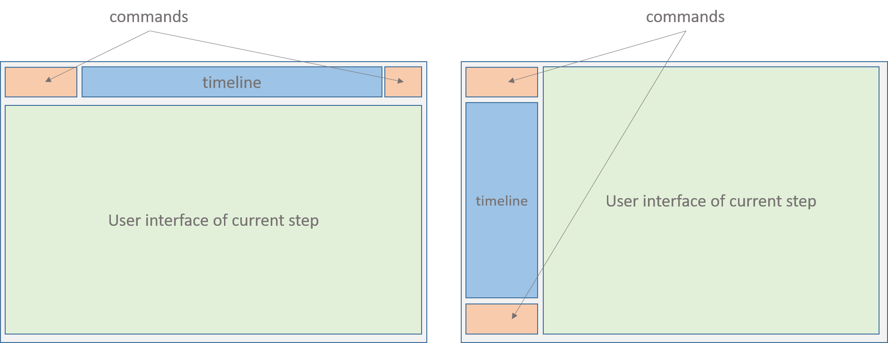
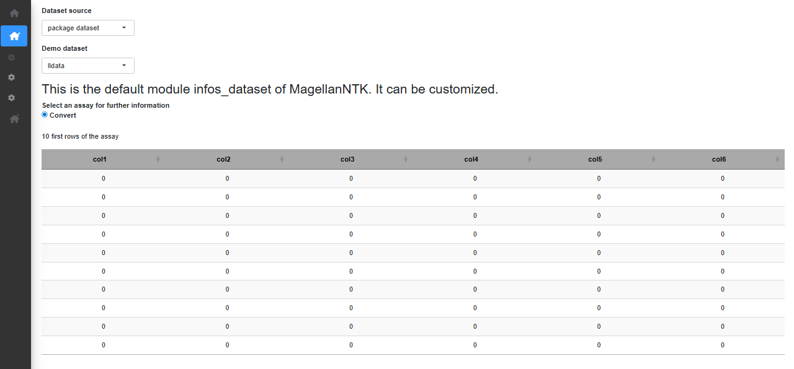
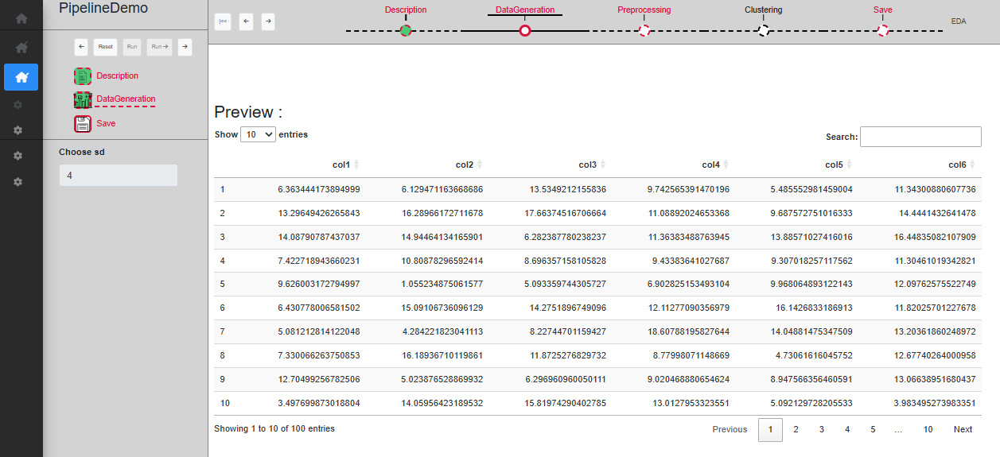
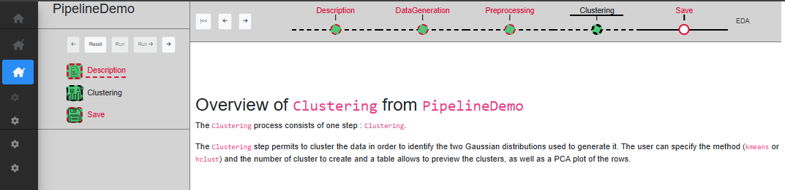

# MagellanNTK user manual

Abstract

The R package MagellanNTK (Magellan Navigation ToolKit) is a workflow
manager using Shiny modules. It is the perfect companion package to
build workflows and integrate them in your UI or run it standalone.

## Introduction

The package MagellanNTK provides the infrastructure for the
configuration, the execution and the surveillance of a defined sequence
of tasks. It builds graphical workflow based on third party tasks,
developed as Shiny modules.

This document covers the description and the use of the user interface
provided by MagellanNTK. It starts with a general overview of workflows
and their principles. Then , it focuses on the User Interface of
`MagellanNTK`.

For a more complete (and technical) information about MagellanNTK, it is
advised to see the `Inside MagellanNTK`

### Main features

MagellanNTK is a highly configurable workflow manager that offers a
qualitative workflow manager and follows a simple but robust strategy.
It allows you to work with data in the `MultiAssayExperiment` format as
well as data derived from it (e.g., `QFeatures`). As a result, it can
process and analyze experimental data from a wide variety of
disciplines. MagellanNTK uses the data structure provided by the
`MultiAssayExperiment` package, which allows experimental data resulting
from a series of processes to be stored. The results of the various data
processing operations are added to the current dataset so that a single
result file contains the information from the entire analysis.

(Fig @ref(fig:UI_mainIntro)).


UI for a single process

The pipelines used with MagellanNTK are plugins in the form of Shiny
modules, whose code is stored in a directory specific to each pipeline.
These plugins are added to MagellanNTK when the application is launched.
The structure of these directories is described in the document ‘Inside
MagellanNTK’. MagellanNTK can run either a complete pipeline (with all
of its processes) or a single process. The latter option is useful for
developing a new process or for faster, more targeted data handling.

One of the key features of MagellanNTK is its high degree of
customization. To achieve this, Shiny modules are extensively used to
simplify the implementation. A number of “Generic functions” are used in
MagellanNTK to do some generic actions for a workflow manager, such as
xxxx

There is a default implementation of these functions in the package
`MagellanNTK` itself but they also can come from plugins containing
pipelines, or from other packages. The choice of these functions is
specified in the configuration file (named config.txt) for each plugin.
In the example plugin provided in MagellanNTK, we see that all these
functions point to MagellanNTK functions (default value).

## Discovering MagellanNTK

MagellanNTK is a R package which proposes a framework to navigate
between steps of a complex data processing tool when the sequence of
processes is mostly chronological.

For example, if a process is composed of three steps, then it is very
easy to run the first step, then the second and finally the last one. It
is like a dataflow manager.

Moreover, this navigation system, which is at the core of MagellanNTK,
can be used at several levels. It is then possible to define, for
example, a super-process (i.e. a pipeline) in which each step is a whole
process containing itself several steps.

### Pipelines, processes and steps

As any workflow manager, the aim of `MagellanNTK` is to execute a series
of ordered tasks over a dataset. The core of the datamanager implements
rules of navigation through the pipeline and processes which ensure the
quality of the whole analysis. This is intended to guide the user
through a validated statistical analysis workflow.

In MagellanNTK, a process is defined as a data analysis process that
performs a minimal and consistent set of operations (called ‘steps’) on
a dataset. Each process has its own input object and returns an object
as output.

In the MagellanNTK lexicon, a workflow (or pipeline) is a set of steps
for processing and analyzing a dataset. Each of these steps (or
processes) can also be composed of one or more sub-steps.

In the example provided with the `MagellanNTK` package, the pipeline is
called “PipelineDemo”. It contains 3 data processing steps:
DataGeneration (which contains 1 step), Preprocessing (with 2 steps:
Filtering and Normalization) and Clustering.

(Fig @ref(fig:pipelineProcessStep)).


UI for a single process

The input and the output of a process is an instance of
`MultiAssayExperiment` (MAE) which contains one or several
`SummarizedExperiment` (SE). The dataset is processed through a sequence
of treatments (defined by the steps) in a classical way for a workflow
manager:

- The steps of a process can be represented as a directional graph with
  no no branches nor cycles. This ensures that the sequence of steps can
  only be executed in a predefined order.
- Each step takes the full dataset as input, but the treatment is
  performed on the last SE instance.
- The output of any step is the same dataset as the input, but with an
  additional SE which corresponds to the result of the operations made
  in that step.

By default, any step can be skipped during the process. So as to ensure
the quality of the process and for mathematical reasons, we introduced a
tag ‘mandatory’ to indicates if a step can be skipped or not. While a
mandatory step is not validated, all subsequent steps are disabled. Once
the mandatory step has been validated, all the following steps are
enabled until the next mandatory one, if there is one.

The implementation of such features is made by mean of *properties* on
steps. Actually, four tags refines the possibilities of a step:

- **Mandatory**: indicates whether a task must be executed to be able to
  continue the workflow.

- **Done-Validated/Undone**: indicates whether a step has been executed
  and validated. If the final step (‘Save’) of a process is validated,
  the MAE dataset is returned with an additional SE compared to the
  input. All features in the MagellanTK UI (Exploratory Data Analyzer,
  ‘Save as’) are updated with this new dataset.

- **Skipped**: indicates whether a task has been skipped (i.e. it is not
  validated and there is at least one step further that has been
  validated). This is only possible with non-mandatory steps.

- **Enabled/disabled**: indicates whether the task is executable (UI is
  enabled or disabled).

Each time a step is validated, a new SE is added to the dataset. This
new dataset is then used as input for the following steps.

### Timelines

Timelines are a graphical representation of the set of steps which
compose the process and pipeline. Each node of the timeline is
represented by a bullet with its name. The style of bullets (the fill
color and the line) depends on the state of the corresponding step. For
all states: \* **line style** solid line for enabled steps, dashed line
for disabled step \* **line color** red for mandatory steps, grey for
skipped step and black otherwise. \* **fill color** empty color (white
by default) for undone steps, green for validated steps

The available states are the following:

|                       Bullet                       |   Property    |  State   | Done/Undone |
|:--------------------------------------------------:|:-------------:|:--------:|:-----------:|
|     |   Mandatory   | Disabled |   Skipped   |
|  | Not Mandatory | Disabled |   Skipped   |
|       |   Mandatory   | Enabled  |   Undone    |
|        |   Mandatory   | Disabled |    Done     |
|   | Not mandatory | Disabled |   Undone    |

At any time, the current step is identified by an underline below the
name of the step. The first step is always the current step at the
beginning of a process (launch) and after the ‘Reset’ action.

In the case of a pipeline, the principle is the same. In the example in
Fig. xxx, the pipeline called ‘PipelineDemo’ has four steps
(Description, DataGeneration, Preprocessing and Clustering). Remark that
the content of the UI area of the pipeline is exactly the whole UI of
its current process (e.g. in Fig @ref(fig:layout)).



1.  Horizontal layout, (b) Vertical layout

Note that in a pipeline timeline, the first step is still ‘Description’
and the last step is called ‘Save’, as it is the case for any process
timeline. The ‘Save’ is technically not necessary as there is already a
‘Save’ step in the last process. Thus, when the user save its work in
the last process of the pipeline, this will automatically save the whole
object and return it to the caller program.

### Rules of navigation

Several rules are applied to guarantee the global strategy of the
workflow and the quality of the analysis process. This point is
important to understand the possibilities of navigation with
MagellanNTK.

When the application is launched, no dataset is loaded. Consequently,
all pipelines, processes, and steps remain disabled until a dataset is
provided. Once a dataset is loaded, it is passed to the pipeline and the
analysis can begin.

**Start workflow at the beginning**.  
At the beginning, the first step (‘Description’) is the only one
enabled. This guarantees to always start from the first step. In the
timeline of the pipeline, the Description step is marked as VALIDATED
because the dataset already contains some information from the ‘Convert’
process.

**One way direction**. Tasks are executed sequentially in a single
direction, from the first to the last.

**A task operates on the most recent SE in the dataset**. As the results
of tasks are stored (SE) in the dataset in the order they have been
produced, the tasks are run over the last SE of the dataset. When a task
produces a new results (SE), it is appended to the end of the dataset
(MAE).

**Run tasks once.** Once a task has been validated, it is marked as DONE
and becomes DISABLED. This feature guarantees that the user cannot run
the same task multiple times on a SE. The only possibility is to reset
the task to restart it. (see xxx).

**Validating a task.** When a task is validated, its state becomes
disabled and all further tasks until the next mandatory one are
automatically enabled.

**Enabled/disabled tasks**. A task is marked as ENABLED because a rule
allow it to be executed at this time. This happens when:

- There is a previous task marked as VALIDATED and there is no MANDATORY
  and UNDONE task between them.
- A dataset has been loaded in MagellanNTK.

**Reset action**. Regardless of whether we consider a pipeline or a
process, the ‘Reset’ strategy is the same. Only the current task can be
reset. Resetting the current task also reset all further tasks. This
feature ensures the tasks are processed only once. When a task is
resetted (the current and any further one), several actions are done: \*
the dataset is resetted to its initial state at the beginning of the
task. Typically, it will only contain the results of previous validated
tasks. \* The UI of the task is re-enabled. \* The widgets go back to
their default values.

**Reset a sub-step of a process**. This is not implemented The only
possibility is to reset the whole process.

**Reset a process**. This can be done by clicking on the Reset button in
the command panel of the process.

**Reset an entire pipeline**. \* In the pipeline command panel, there is
no ‘Reset’ button. To reset a pipeline, the user goes back to the first
step (by clicking enough times on the ‘Prev’ button or by clicking on
the ‘Go back to start’ button). then, switch to the command panel of the
first task (on the vertical timeline) and click on the Reset button.

**Navigation between steps.** It is always possible to navigate between
all the steps event if they are disabled. This feature is useful if one
wants to see/discover the content of next steps or to remind the values
set in the previous widgets.

## Example (PipelineDemo) step by step

In this section, we describe how to use a pipeline workflow. As for the
process workflow, this is a step-by-step guide in which you will switch
between lessons about the interface and practice.

### Overview

The ‘PipelineDemo’ example pipeline is provided with the `MagellanNTK`
package. Its code is stored in the folder ‘inst/workflow/PipelineDemo’.
It contains three data processing steps:

- **DataGeneration**: creates a dataset using two Gaussian
  distributions.
- **Preprocessing**: contains two sub-steps:
  - **Filtering**: filter the rows based on the average or sum of their
    values.
  - **Normalization**: normalize the columns using the sum or average of
    the values in the column.
- **Clustering**: cluster the data in order to identify the two Gaussian
  distributions used to generate it.

Note that the ‘Description’ and ‘Save’ steps are not strictly speaking
data processing steps. The description step displays the contents of a
file in the workflow directory and allows you to view information about
the pipeline. The last step, ‘Save’, allows you to directly access the
module for downloading the processed dataset (the same as if you went
through the “Save as” sidebar).

### Starting the pipeline

‘PipelineDemo’ can be launched by typing the following command in a R
console:

``` r
library(MagellanNTK)
wf.path <- system.file('workflow/PipelineDemo', package = 'MagellanNTK')
MagellanNTK(wf.path, 'PipelineDemo')
```

This will open a new tab in your default web browser with this url:
<http://127.0.0.1:3838>

### General user interface

The user interface consists of two parts: the sidebar on the left and
the main screen.

- Sidebar on the left containing the general menus.
- Main part that displays the workflow manager.


General menu of MagellanNTK (retractable sidebar)

**Sidebar menu**. The sidebar contains the main menus. It expands when
the mouse hovers over it and retracts otherwise. The different menus are
as follows:

- **Home**: provides general information about MagellanNTK. By default,
  content is minimal.

- **Dataset**:

  - **Open file**: allows you to select a dataset to work on.
  - **Import**: allows you to convert a results file into a format
    compatible with MagellanNTK.
  - **Save as**: displays the module called `download_dataset`, which
    allows to export the current dataset. The native MagellanNTK module
    allows exporting in .rdata format. This module is one of the
    configurable modules.

- **Workflow**:

  - **Run**: displays the data manager interface. This interface is
    displayed even if there is no dataset, but at that point, all
    widgets are disabled. They are enabled according to the logic
    implemented in this manager.
  - **FAQ**: opens an Rmd file for FAQ for the current pipeline. This
    file must be stored in the `md` directory within the folder of a
    pipeline.
  - **Manual**: displays the user manual for the current pipeline.
  - **Release notes**: displays the release notes file for the current
    pipeline.

**Main screen** The interfaces linked to the menu items are displayed in
the main screen. Specifically, the data manager will be displayed in
this main section. More details are provided later in this document.
This display is visible when you click on the Workflow/Run sidebar menu.
At this stage of the document, as no dataset has been loaded yet, all
workflow interfaces are disabled. However, the user can still navigate
in the pipeline to discover the various processes and parameters
available.

The user interface provided by MagellanNTK allows to work with processes
and pipelines as well. Thus, the interfaces for processes and pipelines
are very similar and share a lot of features. For this reason, this
section mainly focuses on a process workflow. Describing more complex
structures will be easier.

### Open a dataset

When the application opens, no dataset is loaded. To load one, hover
over the sidebar menu and go to “Dataset” -\> “Open file”. If you
haven’t exported a dataset from MagellanNTK yet, select the “package
dataset” option in “Dataset source” to choose one of the datasets
included in the `MagellanNTK` package. For this tutorial, we select the
‘lldata’ dataset which consists of one SE containing an empty 100 x 6
matrix as assay. Once a dataset is chosen, a short summary of the
dataset is displayed.



opendataset

### Pipeline user interface

To access the workflow, hover over the sidebar menu and go to “Workflow”
-\> “Run”.

In the main screen, one now view the complete pipeline interface. On the
top of the screen, one recognize the pipeline timeine with the steps of
the pipeline and the cammands panel with 3 buttons.

To navigate between processes, use the arrow on the left of the top
timeline. The double arrow to the left of the left arrow allows you to
return with one click to the very first process (Description) from any
process of the workflow. To navigate inside a process, use the arrow in
the left sidebar, above the vertical timeline showing the different step
available.

Even if a step is disabled, it is possible to view the content of it. At
any point during the workflow, the “EDA” button at the top right
provides access to the previously described summary as well as a
complete history of the parameter values used in previously validated
processes.

Below that header, there is the interface of the current process/step
(the one that have the cursor under its name in the pipeline timeline).
The process UI is divided into two parts.

- A sidebar on the left which is always visible.
- All remaining space to show results (tabs, plots and any other stuff).

The content of this part is updated each time the user changes the
current process.

(Fig. @ref(fig:UIsingleProcess)).


UI for a single process

#### Sidebar of a process

The sidebar itself always consists of three regions: commands, timeline
and parameters.

**commands**: shows a panel containing five buttons which allow to
interact and navigate through the different steps of the process: \*
**Previous**. A click on the ‘Prev’ button moves the cursor in the
timeline backward to enables the previous step. If the current step is
the first one, then the previous button is disabled.

- **Reset**. This button is used to reset the entire process (all its
  steps) to its initial state. Several actions follow:

  - The dataset that has been loaded in the process is kept.
  - All the analysis that may have been done are deleted. Thus, the
    bullets in the timeline go to the ‘UNDONE’ state, no matter what
    their state is at the moment the Reset button is clicked.
  - The current step becomes the first one (the cursor in the timeline
    goes under the first step).
  - All the widgets in each step are set to their initial values and
    become disabled (until a dataset is launched in the process).

- **Run**. This action performs the analysis with the selected
  parameters. If there are no sufficient parameters to perform the
  analysis, no analysis is done and a modal info is displayed and invite
  the user to adjust the parameters. Once the action has been done, the
  bullet in the timeline changes its state and pass to ‘DONE’. After
  this calculation, the current step stay unchanged to allow the user to
  view the result of its action on the dataset. This button is disabled
  if the current step is disabled (DONE or SKIPPED).

- **Run and Proceed**. This is the same as the “Run” button but if the
  calculation succeeded, the current step automatically goes to the next
  step. This method is quicker than the previous one but has the
  disadvantage that the user can not immediatly view the results and has
  to click on the ‘Prev’ button to do so.

- **Next**. Clicking on the ‘Next’ button moves the cursor in the
  timeline forward to select the next step. If the current step is the
  last one, then the next button is disabled

**timeline** which represent the sequence of tasks composing the
process, placed in the order they can be executed (from top to bottom).

**Parameters** of the current step. In this part of the sidebar are
displayed the parameters corresponding to the current step. They are
enabled or disabled whether the sate of their step: \* if the step is
disabled (resp. enabled), the widgets are disabled (resp. enabled). \*
If the bullet of a step is enabled then all the widgets of this step are
enabled (as well as the Run buttons). In the contrary, a bullet that is
disabled means that all the widgets and the ‘Run’ buttons in the UI are
disabled.

### ‘Description’ step

The first step is ‘Description’, which only serves as a starting point,
with a short text describing the pipeline. When a dataset is loaded,
this step is automatically validated (Fig.
@ref(fig:pipelinedescription)).


pipelinedescription

At this point, the only action is to click ‘Next’ in the timeline of the
pipeline so as to change the current step to ‘Data Generation’.

### ‘DataGeneration’ step

The first actual step is ‘DataGeneration’. This step is set as
mandatory, so all subsequent processes are disabled until this step is
validated. Like all other processes (with the exception of the
Description at the beginning of the workflow, and Save at the end), it
begins with a Description sub-step and ends with a Save sub-step. There
is only one sub-step in this step, called ‘DataGeneration’. As the whole
step is mandatory and contains only one step, the sub-step
‘DataGeneration’ has to be set as mandatory as well.

The ‘Description’ sub-step serves as a starting point of the process,
with a short text displayed describing the process function. The way
this sub-step work is the same for every process, with only the text
content being different.

The ‘DataGeneration’ sub-step creates a dataset using two Gaussian
distributions. The user can specify the sd to use for these Gaussian
distributions and a table allows to preview the dataset once created.
Once a choice on the sd has been made, you can click on ‘Run’ to
validate and see the created dataset displayed on the table (Fig.
@ref(fig:datageneration3)), or ‘Run -\>’ to directly skip to the save
sub-step.



Step Data generation

The ‘Save’ sub-step allows to validate the whole process. A new SE is
created in the dataset, which can be noticed by clicking on EDA. You can
then go to the next step. The history is also updated with new
informations. Note that the ‘Run -\>’ button is disabled as it is the
last sub-step.

### ‘Preprocessing’ step

The second step is ‘Preprocessing’. This step is set as mandatory, so
all subsequent processes are disabled until this step is validated.
There is two sub-step in this step: ‘Filtering’ and ‘Normalization’.
While the whole step is mandatory, only the ‘Normalization’ sub-step is
mandatory. It is possible to skip the ‘Filtering’ sub-step.

The ‘Filtering’ sub-step allows rows to be filtered based on the average
or sum of their values. The user can specify the method (Sum or Mean),
the operator and the value to use for the filtering and a plot displays
the distribution of sum/mean row values in the dataset. Once a choice of
parameters has been made, you can click on ‘Run’ to validate and see the
filtered dataset on the plot, or ‘Run -\>’ to directly skip to the next
sub-step (Fig. @ref(fig:UIPipelineDemoPreprocessing2)). As this sub-step
is not mandatory, if the next one is validated while ‘Filtering’ is not,
it will become disabled.


Sub-step Preprocessing/Filtering

The ‘Normalization’ sub-step allows columns to be normalized using the
sum or average of the values in the column. The user can specify the
method (Sum or Mean) and a plot displays a boxplot of the column values.
Once a choice of parameters has been made, you can click on ‘Run’ to
validate and see the normalized dataset on the plot (Fig.
@ref(fig:UIPipelineDemoPreprocessing3)), or ‘Run -\>’ to directly skip
to the next sub-step.


Sub-step Preprocessing/Normalization

### ‘Clustering’ step

The third and last actual step is ‘Clustering’. This step is not
mandatory and can be skipped. There is only one sub-step in this step,
called ‘Clustering’.

The ‘Clustering’ sub-step permits to cluster the data in order to
identify the two Gaussian distributions used to generate it. The user
can specify the method (kmeans or hclust) and the number of cluster to
create and a table allows to preview the clusters, as well as a PCA plot
of the rows. Once a choice of parameters has been made, you can click on
‘Run’ to validate and see the filtered dataset on the plot (Fig.
@ref(fig:UIPipelineDemoClustering2)), or ‘Run -\>’ to directly skip to
the next sub-step.


Sub-step Clustering/Clustering

### ‘Save’ step

The last step is ‘Save’, which only serves as a ending point, with a
short text marking the end of the pipeline. Technically, this step does
not need to be validated as it does not change the dataset, which can be
downloaded in “Dataset” -\> “Save as”.

## Reset a step

If at any point a mistake was made in the chosen parameters, or you
simply want to try something else, you can reset any process with the
‘Reset’ button. Resetting a process means that the process in question,
as well as any other process down the timeline, will be resetted with
default values and all SE from these processes will be removed. It means
that the dataset will be set to its initial value as if it is the first
time the user start this process (Fig. @ref(fig:resetastep)).

Keep in mind that this is irreversible, and therefore if the reset was
done by mistake, you will have to start again from this point.



Reset a process


Reset a process

It is possible to quickly reset the whole pipeline by clicking on the
‘Go back to start’ button (in the command panel of the pipeline). The
current process becomes the first one ‘Description’ and then, click on
the ‘Reset’ button of this process. All the processes of the pipeline
will be reseted in one action.

## Run a single process

If one wants to run only a single process, MagellanNTK implements the
ability to launch and run it rather than launch the whole pipeline and
move to the correct process. Another advantage of this feature is the
gain of time it offers when developing (and debugging) a new process for
this pipeline.

To launch a process, the command lines are quite similar to those for
launching a pipeline; one just have to specify the name of the process
to run. In the following example, one launch the process
‘Preprocessing’:

``` r
library(MagellanNTK)
wf.path <- system.file('workflow/PipelineDemo', package = 'MagellanNTK')
MagellanNTK(wf.path, 'PipelineDemo_Preprocessing')
```

This also opens the MagellanNTK framework in the default web browser.
The only difference with running a pipeline is the absence of the
pipeline timeline on the top of the screen. All other UI components stay
available.

An important point here concerns the dataset. As this feature has been
implemented to quickly test new data analysis tool, it has been decided
to simplify the dataset the user will analyze with this process. Thus,
after loading of a dataset, MagellanNTK delete all the SE stored in the
dataset but the last one. The result is a new instance of
`MultiAssayEpxeriment` with only one assay (`SummarizedExperiment`)
renamed ‘Convert’ and which corresponds to the last assay of the real
dataset.

As an example, consider the dataset ‘lldata12’ from the package
`MagellanNTK` which has 3 SE: ‘Convert’, ‘DataGeneration’ and
‘Preprocessing’. If one load this dataset in a single process, then
MagellanNTK will create a new dataset containing only the ‘Convert’
assay which is a renaming of the previous ‘Preprocessing’ assay.

## Session information

``` r
sessionInfo()
```

    ## R version 4.5.2 (2025-10-31)
    ## Platform: x86_64-pc-linux-gnu
    ## Running under: Ubuntu 24.04.3 LTS
    ## 
    ## Matrix products: default
    ## BLAS:   /usr/lib/x86_64-linux-gnu/openblas-pthread/libblas.so.3 
    ## LAPACK: /usr/lib/x86_64-linux-gnu/openblas-pthread/libopenblasp-r0.3.26.so;  LAPACK version 3.12.0
    ## 
    ## locale:
    ##  [1] LC_CTYPE=C.UTF-8       LC_NUMERIC=C           LC_TIME=C.UTF-8       
    ##  [4] LC_COLLATE=C.UTF-8     LC_MONETARY=C.UTF-8    LC_MESSAGES=C.UTF-8   
    ##  [7] LC_PAPER=C.UTF-8       LC_NAME=C              LC_ADDRESS=C          
    ## [10] LC_TELEPHONE=C         LC_MEASUREMENT=C.UTF-8 LC_IDENTIFICATION=C   
    ## 
    ## time zone: UTC
    ## tzcode source: system (glibc)
    ## 
    ## attached base packages:
    ## [1] stats     graphics  grDevices utils     datasets  methods   base     
    ## 
    ## other attached packages:
    ## [1] BiocStyle_2.38.0
    ## 
    ## loaded via a namespace (and not attached):
    ##  [1] digest_0.6.39       desc_1.4.3          R6_2.6.1           
    ##  [4] bookdown_0.46       fastmap_1.2.0       xfun_0.56          
    ##  [7] cachem_1.1.0        knitr_1.51          htmltools_0.5.9    
    ## [10] rmarkdown_2.30      lifecycle_1.0.5     cli_3.6.5          
    ## [13] sass_0.4.10         pkgdown_2.2.0       textshaping_1.0.4  
    ## [16] jquerylib_0.1.4     systemfonts_1.3.1   compiler_4.5.2     
    ## [19] tools_4.5.2         ragg_1.5.0          bslib_0.10.0       
    ## [22] evaluate_1.0.5      yaml_2.3.12         BiocManager_1.30.27
    ## [25] otel_0.2.0          jsonlite_2.0.0      rlang_1.1.7        
    ## [28] fs_1.6.6            htmlwidgets_1.6.4
