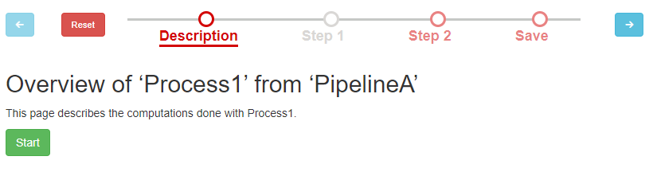
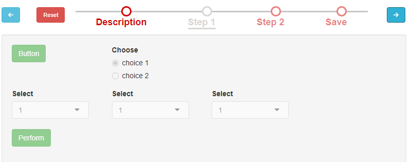
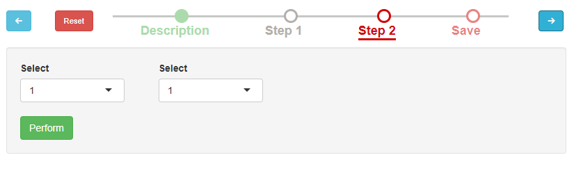
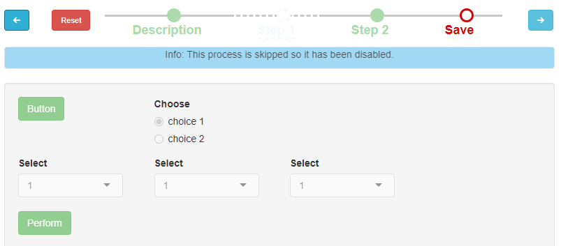

# MagellanNTK user manual

Abstract

The R package MagellanNTK (Magellan Navigation ToolKit) is a workflow
manager using Shiny modules. It is the perfect companion package to
build workflows and integrate them in your UI or run it standalone.

## Introduction

The package MagellanNTK provides the infrastructure for the
configuration, the execution and the surveillance of a defined sequence
of tasks. It builds graphical workflow based on third party tasks,
developed as Shiny modules.

This document covers the description and the use of the user interface
provided by MagellanNTK. It starts with a general overview of workflows
and their principles. Then , it focuses on the User Interface of
`MagellanNTK`.

For a more complete (and technical) information about MagellanNTK, it is
advised to see the `Inside MagellanNTK`

## Discovering MagellanNTK

MagellanNTK is a R package which proposes a framework to navigate
between steps of a complex data processing tool when the succession of
processes is mostly chronological.

For example, if a process is composed of three steps, then it is very
easy to run the first steps, then the second and finally the last one.
It is like a dataflow manager.

Moreover, this navigation system, which is at the core of MagellanNTK,
can by used at several levels. It can then be possible to define, for
example, a super-process (i.e. a pipeline) in which each step is a whole
process containing itself several steps.

### Processes and pipelines

As any workflow manager, the aim of `MagellanNTK` is to execute a series
of ordered tasks over a dataset. The core of the datamanager implements
rules of navigation through the pipeline and processes which ensure the
quality of the whole analysis. This is done to guide the user in a
validated way to statistics anakysis.

Dans le lexique de MagellanNTK, un workflow (ou pipeline) est un
ensemble d’étapes de traitement et d’analyse d’un dataset. Chacune de
ces étapes (ou process) peut également être composée de une ou plusieurs
sous-étapes.

Dans l’exemple fourni avec le package `MagellanNTK`, le pipeline est
appelé “PipelineDemo”. Il contient 4 processes de traitement de données:
\* Generation of data: Génère des données avec deux distributions
gaussiennes différentes, \* Filtering: Supprime des lignes selon un
critère défini par l’utilisateur \* Normalization: Normalise les données
suivants différentes méthodes \* Clustering: Clustering des données

Chacun des 4 processes pouvant contenir 1 ou plusieurs étapes.

### Main features

MagellanNTK est un workflow manager hautement configurable qui propose
un gestionnaire de workflow qualitatif et qui suit une stratégie simple
mais robuste. Il permet de travailler avec des données au format
`MultiAssayExperiment` ainsi que celles qui en sont dérivées (Ex :
`QFeatures`). De ce fait, il peut traiter et analyser des données
expérimentales de domaines très variés. MagellanNTK utilise la structure
de données proposée par le package `MultiAssayExperiment` qui permet de
stocker des données expérimentales résultant d’une série de traitement.
Les résultats des différents traitement des données sont ajoutés au
dataset courant de sorte qu’un seul fichier de résultat contient les
informations de l’ensemble d’une analyse.

Les pipelines utilisés avec MagellanNTK sont des plugins sous forme de
modules Shiny dont le code est stocké dans un répertoire propre à chaque
pipeline. Ces plugins sont ajoutés à MagellanNTK au moment du lancement
de l’application. La structure de ces répertoires est décrite dans le
document ‘Inside MagellanNTK’. MagellanNTK peut faire fonctinner soit un
pipeline complet (avec l’ensemble de ses processe de traitement), soit
un seul de ses process de traitement. Ce dernier cas est intéressant
pour mettre au point un nouveau process ou pour un traitement de données
plus rapide et ciblé.

One of the key feature of MagellanNTK est sa grande possibilité de
personnalisation. Pour cela, il ets fait un usage intensif des modules
Shiny qui rendent cela ^plus facile. Les “fonctions génériques” dans
MagellanNTK sont des fonctions qui peuvent provenir de MagellanNTK
lui-même (fonctions par défaut), ou des plugins contenant les pipelines,
soit d’autres packages. Le choix de ces fonctions est spécifié dans le
fichier de configuration (nommé config.txt) de chaque plugin. Dans
l’exemple de plugin fourni dans MagellanNTK, on voit que toues ces
fonctions pointent vers des fonctions de MagellanNTK (valeur par
défaut).

### First sight of the user interface

The package MagellanNTK is essentiellement based on the `shinydashboard`
package. et a été adapté pour le simplifier (le header et la barre de
contrôle sur la droite ont été supprimés). The user interface is
composed of two parts: the sidebar on the left and the main screen.

- Sidebar on the left qui contient les menus généraux
- Main part qui permet d’afficher le workflow manager

**Sidebar menu**. The sidebar contient les menus principaux. Elle
s’étend au passage de la souris au-dessus et se retracte sinon. Les
différents menus sont les suivants: \* Home: donne des informations
générales sur MagellanNTK. Par défaut, il n’y a pas grand chose. \*
Dataset: \* Open file: permet de sélectionner un dataset sur lequel
travailler \* import: permet de convertir un fichier de résultats en un
format compatible avec MagellanNTK. \* Save as: Affiche le module appelé
`download_dataset` qui permet d’exporter le dataset courant. Le module
natif de MagellanNTK permet l’exportation au format .rdata. Ce module
fait partie des modules configurables

- Workflow:
  - Run: affche l’interface du datamanager. Cette interface est affichée
    même s’il n’y a pas de dataset mais à ce moment la, tous les widgets
    sont désactivés. Ils sont activés suivant la logique implémentée
    dans ce gestionnaire
  - FAQ: Opens a Rmd file for FAQ. This file must be stored in the `md`
    directory whithin the folder of a workflow
  - Manual: Affiche le manual utilisateur du pipeline courant
  - FAQ: Affiche le fichier de la FAQ du pipeline courant
  - Release notes: Affiche le fichier des releases notes du pipeline
    courant

**Main screen** Les interfaces liées aux items du menu sont affichées in
the main screen. C’est notamment dans cette partie principale que
s’affichera le datamanager. Plus de détails dans la suite du document.
Cet affichage est visible lorsque l’on clique dans le menu de la barre
latérale Workflow/Run. A ce stade du document, comme il n(’y a pas
encore de dataset chargé, toutes les interfaces du workflow sont
désactivés). L’utilisateur peut malgré tout naviguer pour décrouvrir les
différents process et paramètres proposés.

The user interface provided by MagellanNTK allows to work with processes
and pipelines as well. Thus, the interfaces for processes and pipelines
are very similar and share a lot of features. For this reason, this
section mainly focuses on a process workflow. Describing more complex
structures will be easier.

## Running a single process

Pour cette section, nous proposons de suivre un example fourni dans
MagellanNTK afin de familiariser l’utilisateur avec les interfaces et le
fonctionnement ). Nous le guidons pas-à-pas pour utiliser l’interface de
MagellanNTK et effectuer un premier traitement de données.

### Start the app

Tout d’abord, nous lançons l’application à l’aide des commandes
suivantes:

``` r
library(MagellanNTK)
wf.name <- 'PipelineDemo_xxx'
wf.path <- system.file('workflow/PipelineDemo', package = 'MagellanNTK')
MagellanNTK(wf.path, wf.name)
```

Ceci ouvrira un nouvel onglet dans votre navigateur internet par défaut.
Th default UI of MagellanNTK is quite empty. The first action to perform
is to load a dataset. This can be done by clicking on the menu
“Datset/open file”. If you haven’t exported yet a dataset to a file from
MagellanNTK, yous should select “demo datasets” option which allows you
to choose one of the dataset in the package `MagellanNTK`. For this
tutorial, you select the ‘lldata’ dataset which is an empty one.

Once the dataset is loaded, the user clicks the menu “Workflow/Run” to
launch the plugin. In the main screen, its interface is displayed.

### Process user interface

The interface for a single process is mainly divided into two parts:

- a sidebar on the left which is always visible,
- all remaining space to show results (tabs, plots and any other stuff)

La sidebar elle-même est toujours composée de 3 régions: \*
**commands**: shows a panel containing five buttons which allow to
interact and navigate through the different steps of the process:

    * Previous: xxxx,
    * Reset: xxx
    * Run: xxx
    * Run and Proceed: xxx
    * Next

- **timeline** which represent the sequence of tasks composing the
  process, placed in the order they might be executed (from top to
  bottom).
- **parameters** of the current screen

#### Commands

**Previous**. A click on the ‘prev’ button moves the cursor in the
timeline backward to enables the previous step. If the current step is
the first one, then the previous button is disabled

**Reset**. This button is used to reset the entire process (all its
steps) to its initial state. Several actions follow:

- The dataset which has been loaded in th process is deleted.
- All the analysis that may have been done are deleted. Thus, the
  bullets in the timeline go to the ‘UNDONE’ state whatever their state
  at the moment of ckicking on the Reset button
- The current step becomes the first one (the cursor in the timeline
  goes under the first step).
- All the widgets in each step are set to their initial values and
  become disabled (until a dataset is launched in the process).

**Run**.

**Run and Proceed**.

**Next**. A click on the ‘Next’ button moves the cursor in the timeline
forward to select the next step. If the current step is the last one,
then the next button is disabled

#### Timeline

At the beginning of a process (launch), In the timeline, steps are
represented by bullets linked by lines. The style of both bullets and
line depends on the state of the corresponding step. If the bullet of a
step is enabled then all the widgets of this step are enabled (as well
as the Perform button). In the contrary, a bullet that is disabled means
that all the widgets and the ‘Perform’ button in the UI are disabled.


Timeline example.

At any time, the current step is marked with an underline below the name
of the step.

|                  Bullet                  |   Property    |  State   | Done/Undone |
|:----------------------------------------:|:-------------:|:--------:|:-----------:|
|   |    Skipped    | Disabled |   Undone    |
|   |   Mandatory   | Disabled |   Undone    |
|    |   Mandatory   | Enabled  |   Undone    |
|  |      \-       | Disabled |    Done     |
|   | Not mandatory |          |   Undone    |

#### Parameters

### Rules of navigation

A more complex workflow consists in a sequence of several tasks, what
defines here a *process*. Processes are implemented as Shiny
applications and embed the functions and UI of each of their single
tasks.

As for single tasks, a process take a list of datasets as input, execute
a series of tasks on the last dataset of the list (the more recent),
then returns a list of datasets. The output list may be:

- identical to the input list (same datasets) if the process did not
  modify it (vizualization functions for example),

- different if the program modifies the data. In this case, MagellanNTK
  adds the modified dataset to the end of the list of datasets rather
  than just updating the last dataset. The new list has one more
  dataset.. Thus, at any time, the list of datasets keeps the entire
  history of what happened to datasets.

In a process workflow, the sequence of tasks is one-way: it always
begins from the first task and ends up at the last one. The simplest
sequence of tasks is the one where each task is executed once, after its
previous neighboor has been executed. However, it may be interesting to
introduce some additional rules to customize this sequence of tasks. As
for example, a given task may be facultative (eventually under some
condition) while another one will be mandatory. The implementation of
such features is made by mean of *properties* on tasks. Actually, four
tags refines the possibilities of a task:

- Mandatory: indicates whether a task must be executed to be able to
  pursiue the workflow.

- Done: indicates whether a task has been executed

- Skipped: indicates whether a task has been skipped (i.e. it is not
  validated and there is at least one task further that has been
  validated)

- Enabled: indicates whether the task is runnable (UI is enabled or
  disabled).

In MagellanNTK, tasks are tagged with a combination of these four tags.
Different styles are used to identify them in the user interface (See
Tab xxx)

In MagellanNTK, a task (or step) is defined as a data analysis process
that performs a minimal and consistent in a set of operations on a
dataset (see Fig @ref(fig:singleTask)) and a user interface based on
Shiny modules. Each task has also its own input object and returns an
object as output. Within MagellanNTK, those objects are *lists* in which
each item is a dataset (several formats are possible).

Les plugins pour MAgellanNTK ne sont pas directement installés dans le
package. Les fichiers d’un plugin sont dans un répertoire spécial (voir
le doucment ‘Inside MagellanNTK’) et ce répertoire peut etre n’importe
où : cela peut être sur l’ordinateur d’un utilisateur, dans un package
R.

Pour utiliser un plugin donné avec MagellanNTK, cela est spécifié comme
paramètre de la fonction
[`MagellanNTK()`](https://edyp-lab.github.io/MagellanNTK/reference/magellanNTK.md).
Pour une plus grande facilité d’utilisation, il est possible de créer un
script R spécifique pour un plugin donné. Dans le code qui suit, on a le
contenu par exmeple d’un fichier appelé ‘PipelineDemo.R’ et qui lance
MagellanNTK avec le plugin de démonstration ‘PipelineDemo’.

A chaque fois qu’une étape est validée, un nouveau SE est ajouté au
dataset. Ce nouveau dataset set ensuite d’entrée pour les étapes
suivantes

### Example (PipelineDemo xxx)

## Running a pipeline workflow

In this section, one describes how to use the pipeline workflow. As for
teh process workflow, this is a step-by-step guide to be more familiar
with the interface. It can be followed by typing the following command
in a R console:

**Launch a pipeline**

When launching a pipeline workflow, two timelines appear: one for the
pipeline itself and the other which is embedded in the UI of the
processes.

Note that the process called ‘Description’ of a pipeline does not have
any steps besides a Description one. This is an exception to the rule
that any process have at least one real step.

### User interface

In the case of a pipeline, the principle is the same. In the example in
Fig. xxx, a pipeline called ‘Pipeline A’ has four steps (Description,
Process 1, Process 2 and Process 3). Remark that the content of the UI
area of the pipeline is exactly the whole UI of its current process
(e.g. in Fig @ref(fig:layout)).


1.  Horizontal layout, (b) Vertical layout

Note that in a pipeline timeline, the first step is still ‘Description’
but there is not more step called ‘Save’ as it is the case for any
process timeline. The reason is because it is not necessary anymore due
to the fact that a ‘Save’ step exists in the last process. Thus, when
the user save its work in the last process of the pipeline, this will
automatically save the whole object and return it to the caller program.

In the next figure (@ref(fig:demopipeline5)), the user has skipped
Process1, has validated all steps of Process2 and he is ready to
validate the Process2. Once done, the bullet for Process2 will change to
‘Done’ and the bullet for ‘Process1’ will change to ‘skipped’. One have
the same behaviour as for processes workflows.

When using a pipeline level, there are two ‘Reset’ Buttons: one for the
pipeline itself and one for the processes. If the Reset button of a
process is clicked, that affects only the current process.

**Resetting a pipeline**

If the Reset button of a pipeline is clicked, this will set back the
entire pipeline to its default values. The object is set back to the
beginning, i.e. all the datasets added by the processes are deleted. In
the pipeline’s timeline, the first step (‘Description’) becomes the
current one.

If the user goes backward on a previous step and validate this step,
then the following steps are automatically set to ‘undone’ and have to
be rerun. This guarantees that the steps are always done in the same
way. This feature must be implemented in each module source code. It
cannot be coded in the navigation module (recursive loop on the listener
of isDone vector)

Similarly to a process, a pipeline is a workflow defined as a sequence
of processes (Fig @ref(fig:pipelineEV)). Thus, the manner of pipeline
works will be very similar to a process behaviour:

- each process (task of a pipeline) in a pipeline has tags and
  properties (See xxx)

- there is a list of datasets in input and get a list of datasets at
  output

As shown in xxx, a pipeline is at third level of such a structure.


A pipeline is a sequence of processes (eclated view).

### Rules of navigation

Some rules are applied to a workflow to guarantee the global strategy of
the workflow and the quality of the analysis process. This point is
important to understand the possibilities of navigation with
MagellanNTK.

#### Load of a new dataset

**Start workflow at the beginning**. When launching a workflow, the
first task is the only enabled task. This guarantees to always start
from the first one. A workflow démarre toujours sur l’étape de
Description qui permet de donner des onformations sur la suite grâce à
un fichier Rmd. Dans la timeline du pipeline, l’icone de cette étape est
affichée en vert car on a un historique (celui de la conversion des
données originales en dataset compatible avec MagellanNTK).
L’utilisateur

**One way direction**. The order in which tasks are executed is in one
direction: tasks are executed from the first one towards the last one.
Each iteration of time is a xxx. It is not possible de go back or rerun
a task that has already been validated (exception if reset, see xxx).

**Chronological order of datasets in the list**. The input object of a
workflow is a list of datasets but the workflow operates only on the
last one (the most recent one). When a workflow produces a new dataset,
this one is added at the end of the list.

**Tasks run once.** In the same way, once a task has been validated, it
becomes disabled. This is to avoid to rerun a task. In this case, that
would mean that a task could modify its own result (modify the dataset
it has already produced). This case is not possible in MagellanNTK

**Validating a task.** When a task is validated, its state becomes
disabled ans all the further tasks until the next mandatory one are
automatically enabled.

**Enabling/disabling tasks**. A disabled task means there is a rule
which do not allow it to be executed at this time. A task at rank *n* is
enabled if there is a previous task with rank *i* (*i \< n*) that has
been validated and if there is no mandatory task of rank *j* (with *i \<
j \< n*) that is not validated.

**Resetting tasks**. It is not possible to reset single tasks (the lower
level of tasks). Only whole processes and pipelines can be reseted. For
more details, see xxx.

**Navigation between steps.** It is always possible to navigate between
all the steps event if they are disabled. This feature is useful if one
wants to see/discover the content of next steps or to remind the values
set in the previous widgets.

#### Commands

Three buttons are available to interact with the whole current step and
navigate through the different steps of the process:


Commands (Previous step, Reset workflow, Next step.

- **Prev** changes the current step to set the previous one. This button
  is enabled only if there is at least one step backward,

- Similarly, **Next** (on the right) changes the current step to set the
  next one on the timeline. This button is enabled only if there is at
  least one step forwards,

- **Reset** sets the workflow in its original state: all the widgets are
  set to their default value, the current step becomes the first one and
  is enabled and all other steps become disabled).

### Rules

### Example

``` r
library(MagellanNTK)
wf.name <- 'PipelineDemo'
wf.path <- system.file('workflow/PipelineDemo', package = 'MagellanNTK')
MagellanNTK(wf.path, wf.name)
```

As a workflow manager, the aim of `MagellanNTK` is to execute a series
of ordered tasks over a dataset.

Dans le lexique de MagellanNTK, un workflow (ou pipeline) est un
ensemble d’étapes de traitement et d’analyse d’un dataset. Chacune de
ces étapes (ou process) peut également être composée de une ou plusieurs
sous-étapes.

Dans l’exemple de workflow fourni avec le package `MagellanNTK`, le
pipeline/workflow est appelé “PipelineDemo”. Il contient 4 étapes de
traitement de données: \* Process A: Génère des données avec deux
distributions gaussiennes différentes, \* Process B: Supprime des lignes
selon un critère défini par l’utilisateur \* Process C: Normalise les
données suivants différentes méthodes \* Process D: Clustering des
données

A noter que les étapes ‘Description’ et ‘Save’ ne sont pas à proprement
parler des étapes de traitement des données. L’étape de description
affiche le contenu d’un fihcier présente dans le répertoire du workflow
et permet d’afficher des informations sur le pipeline. La dernière étape
‘Save’ permet d’accéder directement au module de téléchargement du jeu
de données traité (le même que si on passait par la barre latérale “Save
as”)

### Pipeline

### Interface of a step

The interface for each step contains the graphical elements implemented
by the developer of the workflow such as widgets, plots, textual
information, etc…).

MagellanNTK adds only one button to each interface: the Perform button.
This command is used to validate the step and trigger all the updates in
the workflow (disabling the current step, enabling further ones,
changing the style of bullets, etc..).

## Running a process workflow

This section aims at describing how to use the workflow UI when
processing a dataset. The goal is not to describe the different data
processing tools available but to explain the behaviour of the user
interface of what we call ‘MagellanNTK core’. The next of the section is
a step-by-step guide of working with he UI worklfow. It can be followed
by typing the following command in a R console:

``` r
library(MagellanNTK)
demo_workflow('PipelineA_Process1')
```

The workflow used in this tutorial is a process called ‘Process 1’ which
contains four steps: *Step1* and *Step2* are third party code and
specific to the process while the steps *Description* and *Save* are
added by MagellanNTK for xxx purpose. By default, it comes with a
horizontal layout.

**Starting the workflow**

Once the workflow manager is launched, a window containing the Shiny
application opens (Fig @ref(fig:demo1)). The current task is the first
one (‘Description’) and is enabled. At this time, the other steps are
yet disabled (this is because th Description step is mandatory and none
of the further steps is enabled until this steps is validated).



UI process

However, it is possible to view the content of the other steps even if
they are disabled (Fig @ref(fig:demo12)).



UI process

**Validating the ‘Description’ step**

The validation of the step (See Fig @(ref-fig:demo13) (by a click on the
‘Start’ button) leads to some changes:

- the bullet of the step change from ‘Undone’ to ‘Done’.

- The current step becomes disabled (all its widgets disabled). The
  forwarding steps are enabled if they respect the rule
  **‘Enabling/disabling tasks’** (See Section
  @ref(rules-of-navigation)). In this example, the steps ‘Step 1’ and
  ‘Step 2’ are enabled but not the step ‘Save’ because it is placed
  after a non-validated mandatory step.


UI process

**Go to next step**

The user switches to ‘Step 1’ by clicking on the ‘Next’ button. It
becomes the new current step (Fig @ref(fig:demo2)).


New current step

In this use case, one skip this step. The user do not click on the
‘Perform’ button and switch to the next step (‘Step 2’) by clicking on
the ‘Next’ button. The user set it own values to the widgets and then
validate his choices by clicking on the button ‘Perform’.



UI process

The changes are the following (See Fig @ref(fig:demo33)):

- As for all current steps, the entire interface switch to a disabled
  state,

- the bullet changes to the style of Validated steps

- the next steps become enabled. In this case, there is only one last
  step (‘Save’)

- the style of bullets for previous steps is updated if necessary
  (e.g. ‘Step 1’ switch to the bullet ‘skipped’. Note: A step is really
  marked as skipped only if it has not been validated and a further one
  is validated. That means that one can begin to modify the widgets in a
  step *n*. If the user do not validate it and go to another step
  (*\>n*), then the values of the step *n* will be forgotten.

If one go back to the previous step (the one we have skipped), we can
see a blue area which informs the user that this step has been skipped
(it has been disabled even with no validation). As a skipped step is
disabled, it is not possible to run it despite resetting the whole
workflow and start it again from scratch. This is only true for
processes. We will see that the workflows for pipelines are a bit more
flexible.



UI process

**Saving workflow result**

The last step ‘Save’ is now enabled (by the validation of the previous
step). It is time to save th result of the workflow by clicking on the
‘Save’ button (Fig @ref(Fig:demo4)). This will result in appending the
new dataset to the list of datasets passed as input to the workflow.


UI process

Once this step has been validated, all the steps of the workflow are
disabled.

**Reset a process**

In the workflow of a process, it is not possible to reset one individual
step so as to restart the analysis from this particular step. In this
case, if the user wants to redo one or more steps, it has to reset the
entire workflow. This can be done by clicking on the button ‘Reset’
which set the workflow in its default state (the same state as when the
user launches the workflow). The list of datasets return to the one at
the beginning of the workflow. The reset can be done on every step. A
popup warns the user of the effects (Fig @ref(fig:demoreset)).


UI process

## Session information

``` r
sessionInfo()
```

    ## R version 4.5.2 (2025-10-31)
    ## Platform: x86_64-pc-linux-gnu
    ## Running under: Ubuntu 24.04.3 LTS
    ## 
    ## Matrix products: default
    ## BLAS:   /usr/lib/x86_64-linux-gnu/openblas-pthread/libblas.so.3 
    ## LAPACK: /usr/lib/x86_64-linux-gnu/openblas-pthread/libopenblasp-r0.3.26.so;  LAPACK version 3.12.0
    ## 
    ## locale:
    ##  [1] LC_CTYPE=C.UTF-8       LC_NUMERIC=C           LC_TIME=C.UTF-8       
    ##  [4] LC_COLLATE=C.UTF-8     LC_MONETARY=C.UTF-8    LC_MESSAGES=C.UTF-8   
    ##  [7] LC_PAPER=C.UTF-8       LC_NAME=C              LC_ADDRESS=C          
    ## [10] LC_TELEPHONE=C         LC_MEASUREMENT=C.UTF-8 LC_IDENTIFICATION=C   
    ## 
    ## time zone: UTC
    ## tzcode source: system (glibc)
    ## 
    ## attached base packages:
    ## [1] stats     graphics  grDevices utils     datasets  methods   base     
    ## 
    ## other attached packages:
    ## [1] BiocStyle_2.38.0
    ## 
    ## loaded via a namespace (and not attached):
    ##  [1] digest_0.6.39       desc_1.4.3          R6_2.6.1           
    ##  [4] bookdown_0.46       fastmap_1.2.0       xfun_0.56          
    ##  [7] cachem_1.1.0        knitr_1.51          htmltools_0.5.9    
    ## [10] rmarkdown_2.30      lifecycle_1.0.5     cli_3.6.5          
    ## [13] sass_0.4.10         pkgdown_2.2.0       textshaping_1.0.4  
    ## [16] jquerylib_0.1.4     systemfonts_1.3.1   compiler_4.5.2     
    ## [19] tools_4.5.2         ragg_1.5.0          bslib_0.10.0       
    ## [22] evaluate_1.0.5      yaml_2.3.12         BiocManager_1.30.27
    ## [25] otel_0.2.0          jsonlite_2.0.0      rlang_1.1.7        
    ## [28] fs_1.6.6            htmlwidgets_1.6.4
