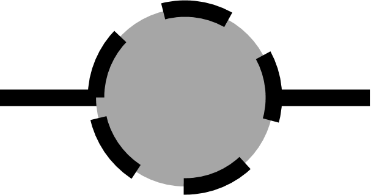

# Introduction

## Objectives of the vignette

The package `MagellanNTK` is a Shiny application which provides the infrastructure for the configuration, the execution and the surveillance of a defined sequence of computational tasks for data analysis, hereafter called "pipelines". It builds graphical pipelines based on third party packages, developed as Shiny modules.

The main vignette accompanying `MagellanNTK` is referred to as "Build a pipeline with MagellanNTK" and is intended for bioinformaticians seeking to deploy application-specific pipelines using `MagellanNTK`; and which will subsequently be used by a pool of data analyst. Such application-specific pipelines may be complex enough to require their own vignette, explaining both the specificities of the pipeline, and some general concerns that are shared by all MagellanNTK-based pipelines. This vignette mimics such a situation by describing a simple pipeline termed `PipelineDemo`, which illustrates the capabilities of `MagellanNTK`. Therefore, this vignette fulfils two goals: First it provides a literate counterpart to the `PipelineDemo` illustration of `MagellanNTK` capabilities. Second, it provides a template that can be used by bioinformaticians deploying a pipeline, so that they can more easily document it and facilitate its handling by the targeted users.


## Intuitive overview of the PipelineDemo app

Contrarily to most "real" `MagellanNTK` pipelines, which should be build using third party Shiny modules, the 'PipelineDemo' example pipeline is provided within the `MagellanNTK` package. Its code is stored in the folder 'inst/workflow/PipelineDemo'. It is a toy pipeline which allows the user to generate data, to apply a couple preprocessing, and to perform cluster analysis. These steps appear in the timeline of the graphical user interface, where they are preceded by a 'Description' step and a 'Save' step that respectively define the beginning and the end of the pipeline.

Before delving into the details of this toy pipeline, let us define some specific `MagellanNTK` features.


## Installation

To install `MagellanNTK` :

```{r install, eval = FALSE}
if (!requireNamespace("BiocManager", quietly = TRUE))
    install.packages("BiocManager")
BiocManager::install("MagellanNTK")
```

```{r setup, message = FALSE}
library(MagellanNTK)
```


# MagellanNTK jargon

## Objects

The key terms used throughout this documentation are defined as follow (Fig. \@ref(fig:keytermsOrganisation)) :

- **Pipeline** : The complete structure that includes the workflow along with all related elements (e.g., FAQ, Convert module, etc).
- **Workflow** : The ordered sequence of processes of the pipeline.
- **Process or step** : An individual step within a workflow. Each process corresponds to a dedicated Shiny module and is implemented in its own file.
- **Sub-step** : An individual step within a process. A process may have as many sub-step as needed.

```{r keytermsOrganisation, results='markup', fig.cap="Visual representation of key terms", echo=FALSE, fig.align='center', fig.wide = TRUE}
knitr::include_graphics("./figs/keytermsOrganisation.png", error = FALSE)
```


In the example pipeline `PipelineDemo`, `PipelineDemo` refers to the complete pipeline. Its workflow consists of three data-processing steps, in addition to an initial Description step and a final Save step. Each of these steps contains one or more sub-steps (Fig. \@ref(fig:pipelinedemoOrganisation)).

```{r pipelinedemoOrganisation, results='markup', fig.cap="PipelineDemo's organisation", echo=FALSE, out.width='100%', fig.align='center', fig.wide = TRUE}
knitr::include_graphics("./figs/pipelinedemoOrganisation.png", error = FALSE)
```


Each step or sub-step can have several associated states, which can change during the workflow :

* **Mandatory/Not mandatory**: Indicates whether a step or sub-step must be completed before continuing the workflow. Mandatory steps cannot be skipped. As long as a mandatory step/sub-step remains undone, all subsequent steps/sub-steps are disabled. Once validated, the following steps/sub-steps become enabled, up to the next mandatory one, if applicable.
* **Validated/Undone/Skipped**: Describes the execution status of a step or sub-step. A step/sub-step can be validated if completed, undone if not yet executed, or skipped if bypassed. Skipping is only possible for non-mandatory steps/sub-steps and occurs when a later step/sub-step has been validated.
* **Enabled/Disabled**: Indicates whether a step or sub-step can currently be executed, i.e., whether its UI is active or inactive.

The state of a step or sub-step can be observed on the timeline (see Section 2.2). 

Workflow steps are always organized linearly, meaning they follow a predefined order and can only be executed sequentially. However, non-mandatory steps may be skipped if needed. The same logic applies to the sub-steps within each process. This structure helps ensure the consistency and quality of the analysis while guiding users through a validated statistical workflow.


## Timelines

Timelines provide a graphical representation of the steps that make up a process or the workflow. Each step is represented by a node displayed as a bullet labeled with its corresponding name. The appearance of each node reflects the state of the associated step :

* **Line style** : Solid for enabled steps, dashed for disabled steps.
* **Line color** : Red for mandatory steps, black for non-mandatory steps.
* **Fill color** : White for undone steps, green for validated steps, and grey for skipped steps.

The possible states are the following :

|                              Bullet                              |   Property    |  State   | Validated/Undone/Skipped |
|:-------------------:|:---------------:|:---------------:|:---------------:|
| {width="40"}  |  Mandatory | Enabled |   Undone    |
| {width="40"}  |  Mandatory | Disabled |   Undone    |
| {width="40"}        |   Mandatory   | Disabled  |   Validated    |
| {width="40"}  |  Not Mandatory | Enabled |   Undone    |
| {width="40"}  |  Not Mandatory | Disabled |   Undone    |
| {width="40"}        |   Not Mandatory   | Disabled  |   Validated    |
| {width="40" } |  Not Mandatory | Disabled |    Skipped     |


At any point during the workflow, the current step is indicated by an underline beneath the step name. 


Two distinct timelines are displayed in the interface. The first, located at the top of the screen, is the horizontal workflow timeline, which contains all steps of the workflow. The second, located in the process sidebar on the left, is a vertical timeline displaying all sub-steps of the currently active process. Everything described previously applies to both timelines.


In the example in Fig. \@ref(fig:timelinelayout), the different steps of `PipelineDemo` are displayed in the horizontal timeline at the top. The current step is 'Preprocessing', indicated by the underline beneath its name, and its sub-steps are displayed in the vertical timeline on the left, with 'Description' being the current sub-step. 

```{r timelinelayout, results='markup', fig.cap="(a) Horizontal workflow timeline, (b) Vertical step timeline", echo=FALSE, out.width='100%', fig.align='center', fig.wide = TRUE}
knitr::include_graphics("./figs/timelinelayout.png", error = FALSE)
```


## Navigation

`MagellanNTK` is designed so that every part of a pipeline remains accessible at all times. However, most of these, including the workflow itself, are disabled until a dataset is loaded. This ensures that the analysis can only begin when a valid dataset has been provided. 

The workflow always starts with the 'Description' step, which must be validated before subsequent steps become enabled. It then follows a strictly linear structure, meaning that each step must be executed in a predefined order, never in parallel or out of order. However, some steps or sub-steps may be skipped if they are not mandatory. 

The navigation in the workflow is flexible. It is always possible to move between any steps or sub-steps at any time, even if they are disabled. This makes it possible to explore upcoming steps of the workflow or look at previous results or parameters, without affecting the current state or execution of the workflow.

When a step is validated, it is marked as validated and becomes disabled. At the same time, all subsequent steps are automatically enabled up to the next mandatory step, if one exists. 

A step can only be executed once. If a mistake has been made or the parameters should be changes, the step must be reset (see Section 4.1). This restores both the dataset and the step to the state they were in before the step was run. The step is re-enabled and all widgets return to their default values. Resetting a step automatically resets all subsequent steps. Individual sub-steps cannot be reset independently, only entire step. 

If a dataset that has already passed either fully or partially through the pipeline is loaded, it retains information about which steps and sub-steps have already been validated. As a result, the workflow automatically marks those steps as validated and resumes from the next undone step.


## Data format requirements

`MagellanNTK` relies on `MultiAssayExperiment` (MAE) objects to store and manage data throughout the pipeline. A MAE can be viewed as a container that holds one or more datasets, called `SummarizedExperiment` (SE). At each step, rather than modifying an existing dataset, the results of the process is added to the MAE as a new SE. As a result, all intermediate and final results are stored in a single object. Thus, this structure makes it possible to keep track of the different steps of the analysis while preserving previous results. 

Because the pipeline is built around this format, datasets must be available as MAE objects before they can be processed. However, it is not necessary for the original data to already be in this format. The 'Convert' process can be configured to import other file types (such as .csv or .txt) and convert them into a valid MAE, making them compatible with the rest of the pipeline (see Section 3.5.1). 

Along with adding a new SE at the end of each step, the values of the parameters used during the analysis are recorded in a history table. This history provides a complete record of the actions performed on the dataset, making it possible to review the entire analysis and ensure full traceability of the workflow. Each entry in the history contains the name of the step, the name of the sub-step, the parameter name, and its corresponding value.


## General user interface 

The user interface is divided into two main sections (Fig. \@ref(fig:mainInterface)) :

- **The main sidebar**, located on the left, which provides access to the general menus.
- **The main interface**, which displays the pipeline.

```{r mainInterface, results='markup', fig.cap="General user interface : (a) Main sidebar, (b) Main interface", echo=FALSE, out.width='100%', fig.align='center', fig.wide = TRUE}
knitr::include_graphics("./figs/mainInterface.png", error = FALSE)
```


### Main sidebar 

The main sidebar, located on the left side of the general interface, provides access to the general menus. It automatically expands when the mouse cursor hovers over it and collapses otherwise. The sidebar is organized into several main menus, each of which may contains submenus (Fig. \@ref(fig:menuSidebar)).

```{r menuSidebar, results='markup', fig.cap="The general menus of the main sidebar", echo=FALSE, out.width='100%', fig.align='center', fig.wide = TRUE}
knitr::include_graphics("./figs/menuSidebar.png", error = FALSE)
```

The different menus are as follows:

- **Home** : Displays general information about the pipeline.
  
- **Dataset** :
  - **Open file** : Allows a dataset to be loaded into the pipeline, either from a local file or from an existing dataset provided by a selected package.
  - **Import** : Provides access to the conversion module, which can be used to transform external data files into a compatible format.
  - **Save as** : Allows the current dataset to be exported.
  
- **Workflow** :
  - **Run** : Opens the workflow interface. This interface is always accessible, even when no dataset has been loaded. In that case, all widgets remain disabled until a valid dataset is available.
  - **FAQ** : Displays the FAQ document associated with the current pipeline.
  - **Manual** : Opens the user manual for the current pipeline.
  - **Release notes** : Displays the release notes associated with the current pipeline.


### Main interface

The content of the main panel depends on the selected menu. In most cases, the interface remains relatively simple and contains only a few elements. However, within a workflow, this interface is more elaborate and include elements related to the execution and navigation of the workflow.

The interface within a workflow can be separated in 3 parts (Fig. \@ref(fig:mainInterfaceGeneral)) :

- **Process sidebar**
- **Workflow header**
- **Content area**

```{r mainInterfaceGeneral, results='markup', fig.cap="Main interface during a workflow : (a) Process sidebar, (b) Workflow header, (c) Content area", echo=FALSE, out.width='100%', fig.align='center', fig.wide = TRUE}
knitr::include_graphics("./figs/mainInterfaceGeneral.png", error = FALSE)
```

#### Process sidebar

The process sidebar can be separated in 3 parts (Fig. \@ref(fig:mainInterfaceSidebar)) : 

- The **pipeline name** : The name of the current pipeline. 
- The **process timeline** : The timeline of the current process (see Section 2.2), as well as the buttons used to navigate through and reset the process. 
- The **parameters** : The parameters and associated widgets for the current process.

The process timeline is specific to each process, while the parameters vary across sub-steps.

```{r mainInterfaceSidebar, results='markup', fig.cap="Composition of the process sidebar : (a) Pipeline name, (b) Process timeline, (c) Parameters", echo=FALSE, out.width='40%', fig.align='center', fig.wide = TRUE}
knitr::include_graphics("./figs/mainInterfaceSidebar.png", error = FALSE)
```

There are 5 navigation buttons (Fig. \@ref(fig:mainInterfaceSidebarButtons)). The first one and last ones are respectively the 'Previous' and 'Next' buttons, which allow navigation to the previous or next sub-step within the current step. The 'Reset' button is used to reset the current step (see Section 4.1). The 'Run' and 'Run ->' button are both used to validate the current sub-step, but differ in behavior : 'Run' simply validates the sub-step, whereas 'Run ->' validates the sub-step and automatically moves to the next sub-step.

```{r mainInterfaceSidebarButtons, results='markup', fig.cap="The process sidebar's buttons : (a) 'Previous' button, (b) 'Reset' button, (c) 'Run' button, (d) 'Run ->' button, (e) 'Next' button", echo=FALSE, out.width='50%', fig.align='center', fig.wide = TRUE}
knitr::include_graphics("./figs/mainInterfaceSidebarButtons.png", error = FALSE)
```

#### Workflow header

The workflow header can be separated in 2 parts (Fig. \@ref(fig:mainInterfaceHeader)) : 

- The **workflow timeline** : The timeline of the current workflow (see Section 2.2), as well as the buttons used to navigate through the workflow. 
- The **EDA button** : The button to access the Exploratory Data Analyzer (EDA) (see Section 3.3).

```{r mainInterfaceHeader, results='markup', fig.cap="Composition of the workflow header : (a) Workflow timeline, (b) EDA button", echo=FALSE, out.width='100%', fig.align='center', fig.wide = TRUE}
knitr::include_graphics("./figs/mainInterfaceHeader.png", error = FALSE)
```

There are 3 navigation buttons (Fig. \@ref(fig:mainInterfaceHeaderButtons)). The first one is the 'Go back to start' button, which allows to return to the 'Description' step in a single click. The other two buttons are used to navigate to the previous or next step in the workflow.

```{r mainInterfaceHeaderButtons, results='markup', fig.cap="The workflow header's buttons : (a) 'Go back to start' button, (b) 'Previous' and 'Next' buttons", echo=FALSE, out.width='40%', fig.align='center', fig.wide = TRUE}
knitr::include_graphics("./figs/mainInterfaceHeaderButtons.png", error = FALSE)
```

#### Content area

The content area is the section of the interface where tables or graphical outputs (such as plots) are displayed throughout the workflow.


# Step-by-step discovery of PipelineDemo

## Launch the pipeline

`PipelineDemo` can be launched by typing the following command in a R console :

```{r lanchpipelinedemo, eval = FALSE}
library(MagellanNTK)
wf.path <- system.file('workflow/PipelineDemo', package = 'MagellanNTK')
MagellanNTK(wf.path, 'PipelineDemo')
```

This will open a new tab in your default web browser with this url : 
http://127.0.0.1:3838

After a short loading screen, the pipeline will be open on the home page (Fig. \@ref(fig:homePage)). 

```{r homePage, results='markup', fig.cap="Home page", echo=FALSE, out.width='100%', fig.align='center', fig.wide = TRUE}
knitr::include_graphics("./figs/homePage.png", error = FALSE)
```

## Open a dataset

When the application opens, no dataset is loaded. To load one, hover over the main sidebar menu and go to 'Dataset' -> 'Open file'. If you haven't exported a dataset from MagellanNTK yet, select the 'package dataset' option in 'Dataset source' to choose one of the datasets included in the `MagellanNTK` package. For this example, we select the 'lldata' dataset which consists of one SE containing an empty 100 x 6 matrix as assay. 
Once a dataset is chosen, a short summary of the dataset is displayed (Fig. \@ref(fig:opendataset)). 

```{r opendataset, results='markup', fig.cap="Open a dataset", echo=FALSE, out.width='100%', fig.align='center', fig.wide = TRUE}
knitr::include_graphics("./figs/UI_mod_open_dataset.png", error = FALSE)
```


## Exploratory Data Analyzer (EDA)

The Exploratory Data Analysis (EDA) tool is designed to provide a range of information and visualizations about the current dataset at any point during the workflow. It allows the dataset to be examined at any stage of the workflow, including its content, the operations that have been performed on it, and the results obtained so far. The EDA tool is accessible at any time during the workflow via the EDA button located in the top-right corner.

It contains 3 tabs :

- **Info** : Presents general information about the dataset (Fig. \@ref(fig:EDA1)).
- **History** : Displays the dataset history, which include all parameter values recorded during the analysis (see Section 2.4) (Fig. \@ref(fig:EDA2)).
- **EDA** : Provides various visualizations for exploring the dataset and the results obtained at the any step of the workflow (Fig. \@ref(fig:EDA3)). 

```{r EDA1, results='markup', fig.cap="EDA 'Infos' tab", echo=FALSE, out.width='100%', fig.align='center', fig.wide = TRUE}
knitr::include_graphics("./figs/UI_EDA1.png", error = FALSE)
```

```{r EDA2, results='markup', fig.cap="EDA 'History' tab", echo=FALSE, out.width='100%', fig.align='center', fig.wide = TRUE}
knitr::include_graphics("./figs/UI_EDA2.png", error = FALSE)
```

```{r EDA3, results='markup', fig.cap="EDA 'EDA' tab", echo=FALSE, out.width='100%', fig.align='center', fig.wide = TRUE}
knitr::include_graphics("./figs/UI_EDA3.png", error = FALSE)
```


## Workflow
### 'Description' step

The first step, 'Description', serves as an introduction to the pipeline and displays a brief overview of its purpose. When a dataset is loaded, this step is automatically marked as validated (Fig. \@ref(fig:pipelinedescription)). 


```{r pipelinedescription, results='markup', fig.cap="Description step", echo=FALSE, out.width='100%', fig.align='center', fig.wide = TRUE}
knitr::include_graphics("./figs/UI_PipelineDemo_Description.png", error = FALSE)
```

No particular action needs to be taken here. Click on the 'Next' button in the timeline of the pipeline so as to change the current step to 'Data Generation'.


### 'DataGeneration' step

The first data processing step is 'DataGeneration'. This step is set as mandatory, meaning that all subsequent processes remain disabled until it has been validated. Like all other processes (with the exception of the 'Description' and 'Save' processes, respectively at the beginning and the end of the workflow), it includes an initial 'Description' sub-step and a final 'Save' sub-step. Between these two, there is only one data processing sub-step in this step, called 'DataGeneration'. As the whole step is mandatory and contains only one data processing sub-step, 'DataGeneration' is mandatory as well.

The 'Description' sub-step serves as a starting point of the process, with a short text displayed describing the process purpose. This sub-step behavior is the same for every process, only the displayed text differs.

The 'DataGeneration' sub-step generates a dataset from two Gaussian distributions. The user can specify the standard deviation (sd) to use for these distributions, and a table allows to preview the dataset after it has been created. 
Once the desired standard deviation has been selected, clicking on 'Run' validates the sub-step and displays the generated dataset in the table (Fig. \@ref(fig:datageneration3)). Alternatively, clicking 'Run ->' validates the sub-step and automatically proceeds to the next one.

```{r datageneration3, results='markup', fig.cap="'Data generation' sub-step", echo=FALSE, out.width='100%', fig.align='center', fig.wide = TRUE}
knitr::include_graphics("./figs/UI_PipelineDemo_DataGeneration3.png", error = FALSE)
```

The 'Save' sub-step allows to validate the whole process. Once validated, a new SummarizedExperiment is added to the dataset, which can be verified through the EDA window (see Section 3.3), and the history is also updated with information about the parameters used in the process (see Section 2.4). Once this sub-step has been validated, the whole process is validated as well, and the workflow can proceed to the next step. Note that, since 'Save' is the last sub-step of the process, the 'Run ->' button is disabled.


### 'Preprocessing' step

The second step is 'Preprocessing'. This step is set as mandatory, meaning that all subsequent processes remain disabled until it has been validated. There are two sub-steps in this step, in addition to 'Description' and 'Save' : 'Filtering' and 'Normalization'. While the 'Preprocessing' step is mandatory, only the 'Normalization' sub-step is also mandatory, making it possible to skip the 'Filtering' sub-step.

The 'Filtering' sub-step allows rows to be filtered based on either the mean or the sum of their values. The user can choose the method (Mean or Sum), the operator and the threshold value used for the filtering. A plot displays the distribution of sum/mean row values in the dataset.
Once the parameters have been set, clicking on 'Run' validates the sub-step and updates the plot to reflect the filtered dataset. Alternatively, clicking 'Run ->' validates the sub-step and automatically proceeds to the next one (Fig. \@ref(fig:UIPipelineDemoPreprocessing2)). 
Since this sub-step is not mandatory, if the subsequent sub-step is validated while 'Filtering' is not, it will become disabled.

```{r UIPipelineDemoPreprocessing2, results='markup', fig.cap="'Filtering' sub-step", echo=FALSE, out.width='100%', fig.align='center', fig.wide = TRUE}
knitr::include_graphics("./figs/UI_PipelineDemo_Preprocessing2.png", error = FALSE)
```

The 'Normalization' sub-step allows columns to be normalized using either the mean or the sum of their values. The user can select the normalization method (Mean or Sum), and a boxplot displays the distribution of column values. 
Once the parameters have been set, clicking on 'Run' validates the sub-step and updates the plot to reflect the normalized dataset (Fig. \@ref(fig:UIPipelineDemoPreprocessing3)). Alternatively, clicking 'Run ->' validates the sub-step and automatically proceeds to the next one.

```{r UIPipelineDemoPreprocessing3, results='markup', fig.cap="'Normalization' sub-step", echo=FALSE, out.width='100%', fig.align='center', fig.wide = TRUE}
knitr::include_graphics("./figs/UI_PipelineDemo_Preprocessing3.png", error = FALSE)
```


### 'Clustering' step

The third step is 'Clustering'. This step is not mandatory and can be skipped. There is only one sub-step in this step, in addition to 'Description' and 'Save', called 'Clustering'.

The 'Clustering' sub-step performs data clustering to help identify the two Gaussian distributions previously used for data generation. The user can select the clustering method (kmeans or hclust) and the number of cluster to create. A table is provided to preview the resulting clusters, along with a PCA plot visualizing the observations.
Once the parameters have been set, clicking on 'Run' validates the sub-step and updates the plot and table to reflect the clustered dataset (Fig. \@ref(fig:UIPipelineDemoClustering2)). Alternatively, clicking 'Run ->' validates the sub-step and automatically proceeds to the next one.

```{r UIPipelineDemoClustering2, results='markup', fig.cap="'Clustering' sub-step", echo=FALSE, out.width='100%', fig.align='center', fig.wide = TRUE}
knitr::include_graphics("./figs/UI_PipelineDemo_Clustering2.png", error = FALSE)
```


### 'Save' step

The last step is 'Save', which mainly serves as a ending point, with a short text marking the end of the pipeline. Technically, this step does not need to be validated as it does not change the dataset, which can be downloaded in 'Dataset' -> 'Save as'.


## Other parts of the pipeline 
### 'Convert' process

The 'Convert' process is accessible from the 'Dataset' -> 'Import' tab. Its purpose is to import data from external formats and convert them into a `MultiAssayExperiment`, which is the format required by the pipeline (see Section 2.4). This makes it possible to work with raw data files such as .csv, .txt, and other supported formats. Although the 'Convert' process is structured in the same way as a workflow step, with its own sub-steps and interface, it is not part of the workflow itself. Instead, it is a standalone process that belongs to the pipeline and serves as an entry point for preparing datasets before they enter the workflow.

In this pipeline, the 'Convert' process is intentionally left empty and does not perform any conversion. This is by choice, as `PipelineDemo` is intended solely as a demonstration pipeline and does not rely on any real input datasets that would need to be imported or converted \@ref(fig:convertProcess)).

```{r convertProcess, results='markup', fig.cap="Convert process", echo=FALSE, out.width='100%', fig.align='center', fig.wide = TRUE}
knitr::include_graphics("./figs/convertProcess.png", error = FALSE)
```


### 'Save as' tab

The 'Save as' tab allows to download the dataset at any point during the workflow. Several output formats may be available depending on the configuration. Only validated steps are recorded in the dataset, meaning that any ongoing or unvalidated steps are not included in the exported output. As such, the exported file always corresponds to the last validated state of the workflow, and not any unfinished step.

```{r saveProcess, results='markup', fig.cap="'Save as' tab", echo=FALSE, out.width='100%', fig.align='center', fig.wide = TRUE}
knitr::include_graphics("./figs/saveProcess.png", error = FALSE)
```


### 'Manual', 'FAQ' and 'Release Notes' tabs

The 'Manual', 'FAQ', and 'Release Notes' tabs provide access to the pipeline documentation. They contain, respectively, the user manual, frequently asked questions, and the release notes describing changes and updates made to the pipeline over time.


# Other functionalities

## Resetting a step

If, at any point, an incorrect parameter is selected or you wish to try a different configuration, a process can be reset using the 'Reset' button. Resetting a process restores it to its default state, as if it were being launched for the first time. This action also resets all downstream processes in the workflow and removes any SummarizedExperiment created by those processes. As a result, the dataset is reverted to its initial state, as if the process had never been executed, allowing the analysis to be rerun from that point (Fig. \@ref(fig:resetastepbef) and \@ref(fig:resetastepaft)).

Please note that this action is irreversible. If the pipeline is reset unintentionally, the analysis will need to be restarted from that point onward.

```{r resetastepbef, results='markup', fig.cap="Before resetting the 'Preprocessing' process", echo=FALSE, out.width='100%', fig.align='center', fig.wide = TRUE}
knitr::include_graphics("./figs/beforeResetingProcess.png", error = FALSE)
```

```{r resetastepaft, results='markup', fig.cap="After resetting the 'Preprocessing' process", echo=FALSE, out.width='100%', fig.align='center', fig.wide = TRUE}
knitr::include_graphics("./figs/afterresetPreprocessing.png", error = FALSE)
```

To reset the entire pipeline easily, click the 'Go back to start' button located to the left of the workflow timeline (see 2.5). This automatically returns the workflow to the first process, which is 'Description'. From there, clicking the 'Reset' button will reset all processes in the pipeline at once.


## Running a single process

MagellanNTK also allows individual processes to be run independently, without launching the entire workflow. This can be useful when only a specific process is needed for an analysis, as it is faster than starting the full pipeline and manually navigating to the desired step.

To launch a process, the command lines are quite similar to those for launching a pipeline; one just have to specify the name of the process to run. For example, the process 'Preprocessing' can be launched by typing the following command in a R console :

``` {r launch, eval = FALSE}
library(MagellanNTK)
wf.path <- system.file('workflow/PipelineDemo', package = 'MagellanNTK')
MagellanNTK(wf.path, 'PipelineDemo_Preprocessing')
```

This will open a new tab in your default web browser with this url : 
http://127.0.0.1:3838

Most of the interface remains identical to that of the full pipeline. The main difference is that the application behaves as if the workflow only contained the 'Preprocessing' step. As a result, only the vertical timeline is displayed, since the horizontal workflow timeline is not needed in this case.

```{r singleprocess, results='markup', fig.cap="'Preprocessing' process when launched as a single process", echo=FALSE, out.width='100%', fig.align='center', fig.wide = TRUE}
knitr::include_graphics("./figs/singleprocess.png", error = FALSE)
```

One important point concerns dataset loading. When a `MultiAssayEpxeriment` is loaded, only its last `SummarizedExperiment` is kept and automatically renamed to 'Convert'. 


# Session information {-}

```{r sessioninfo}
sessionInfo()
```
